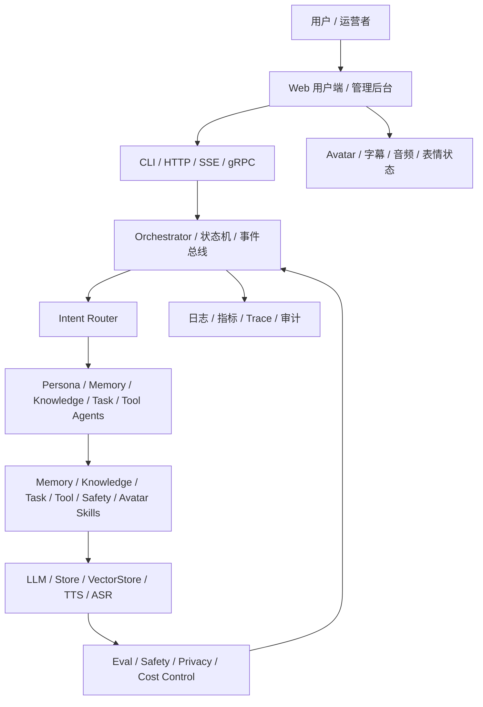

# digital-twin

面向专业数字人的 Go 多 Agent 系统规划与实现路线。

## 当前状态

本仓库已完成 **Phase 1 内核契约与基础设施**。当前已包含 Go module、基础目录骨架、配置加载、结构化日志、领域错误、公共数据契约、核心接口、Registry、测试 fake、LLM 抽象、OpenAI-compatible fake-server tested client、本地文件存储、内存向量库、短期/长期记忆基础设施和本地 EventBus。

业务层仍未进入 Phase 2：尚未实现 persona prompt、真实 intent classifier、专家 Agent、Skill 库、HTTP API、Web UI、TTS/ASR 或 Avatar 表现层。

## 项目定位

`digital-twin` 目标是构建一个可工程化落地的专业数字人系统，而不只是聊天机器人。它需要同时覆盖人格一致性、长期记忆、知识库问答、工具调用、运行时编排、语音/Avatar 表现层、管理后台、评测治理和安全合规。

第一版建议聚焦“文本 + 语音的专家顾问数字人”：

- 稳定 persona 与语气。
- 基于知识库回答并展示引用来源。
- 支持可查看、可删除的长期记忆。
- 提供 Web 聊天和基础语音播报。
- 支持后台配置 persona、知识库和工具权限。

## 核心能力

- **人格**：Persona 配置、System Prompt 渲染、人格一致性守卫。
- **记忆**：短期会话窗口、长期摘要记忆、语义召回、记忆治理。
- **知识**：RAG 检索、引用标注、知识库版本和来源管理。
- **工具**：Skill 参数校验、工具白名单、权限控制和失败降级。
- **编排**：Router、Agent、Skill、Orchestrator、状态机和并发调度。
- **表现层**：TTS、ASR、字幕时间轴、Avatar 状态、打断策略。
- **后台**：Persona 编辑、记忆管理、知识库管理、工具权限、运营看板。
- **治理**：AI 行为评测、隐私合规、安全策略、成本统计、发布回滚。

## 架构概览



## Phase 路线图

| Phase | 名称 | 目标 |
| --- | --- | --- |
| Phase 0 | 项目定义与工程基线 | 明确 MVP，建立 Go 工程、配置、日志、错误、测试和 CI 基础。 |
| Phase 1 | 内核契约与基础设施 | 定义数据契约、接口、mock、Registry、LLM、存储、向量库和记忆。 |
| Phase 2 | 人格、路由、Skill 与 Agent | 落地 persona、路由、Skill 库和五类专家 Agent。 |
| Phase 3 | 编排运行时与 API 入口 | 串起 Orchestrator、状态机、容错、CLI、HTTP/SSE 和部署草案。 |
| Phase 4 | 数字人表现层与产品后台 | 建立 TTS/ASR/Avatar 事件流、Web 用户端和运营后台。 |
| Phase 5 | 治理、评测、安全与运营 | 建设 eval、安全、隐私、成本、发布回滚和反馈闭环。 |

完整拆解见 [plan.md](./plan.md)。

## SDD 文档

Phase 0 按 spec-driven development 流程补齐了规格和设计文档：

- [Phase 0 Engineering Baseline Spec](./docs/specs/phase-0-engineering-baseline.md)
- [Phase 0 Engineering Baseline Design](./docs/design/phase-0-engineering-baseline.md)

Phase 1 已按 SDD 流程补齐规格、设计和执行计划：

- [Phase 1 Core Contracts and Infrastructure Spec](./docs/specs/phase-1-core-contracts-infrastructure.md)
- [Phase 1 Core Contracts and Infrastructure Design](./docs/design/phase-1-core-contracts-infrastructure.md)
- [Phase 1 Core Contracts and Infrastructure Plan](./docs/plans/phase-1-core-contracts-infrastructure-plan.md)

## 仓库结构

当前仓库已完成 Phase 1，核心结构如下：

```text
digital-twin/
├── cmd/
│   ├── cli/
│   └── server/
├── configs/
├── internal/
│   ├── config/
│   ├── core/
│   ├── llm/
│   ├── memory/
│   ├── runtime/
│   ├── store/
│   ├── observability/
│   └── testutil/
├── pkg/
│   └── types/
├── README.md
├── RELEASE_NOTES.md
├── go.mod
├── Makefile
└── plan.md
```

未来完整代码目录以 [plan.md](./plan.md) 中的目标目录结构为准。

## 推荐下一步

按 `AGENTS.md` 的 SDD gate 推进 Phase 2：

1. 基于 `plan.md` 为 Phase 2 补充 spec、design 和执行计划。
2. 明确 persona、prompt renderer、router、Skill 和 Agent 的边界。
3. 继续使用 TDD，小步实现 persona、router、Skill 库和专家 Agent。
4. 每个小步完成后运行对应 package test，并在阶段收尾运行 `go test ./...`、`go vet ./...` 和 `go build ./cmd/server`。

## 开发原则

- 小步提交：一个步骤一次实现，避免跨 Phase 混改。
- 接口先行：先定义数据契约和 interface，再写实现。
- Mock 优先：外部 LLM、DB、TTS、ASR 先用 fake server 或 mock。
- 可验证交付：每次变更都必须说明验证命令和预期结果。
- 文档同步：关键架构决策要进入 `docs/` 或 ADR。
