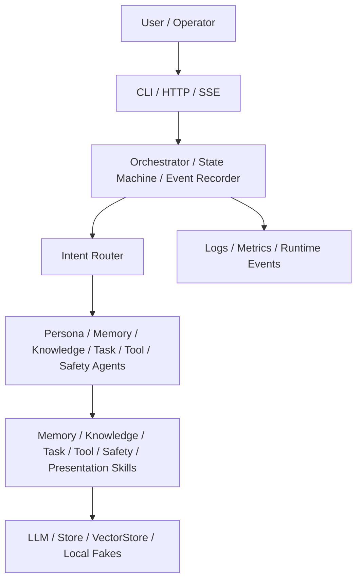

# digital-twin

面向专业数字人的 Go 多 Agent 系统规划与实现路线。

## 当前状态

本仓库已完成到 **Phase 3 编排运行时与 API 入口**。

当前已包含 Go module、配置加载、结构化日志、领域错误、公共数据契约、核心接口、Registry、测试 fake、LLM 抽象、本地文件存储、内存向量库、记忆基础设施、本地 EventBus、Persona 模型、prompt renderer、persona guard、rule/LLM/hybrid router、Skill 参数校验框架、确定性 Skill 库、BaseAgent、六类专家 Agent、生产 Orchestrator、本地 runtime bootstrap、CLI one-shot、HTTP `/health` `/metrics` `/chat` 和 SSE `/chat/stream`。

Phase 4 尚未开始：还没有 Web UI、产品后台、真实 TTS/ASR 或真实 Avatar 表现层。

## 项目定位

`digital-twin` 目标是构建一个可工程化落地的专业数字人系统，而不只是聊天机器人。它需要同时覆盖人格一致性、长期记忆、知识库问答、工具调用、运行时编排、语音/Avatar 表现层、管理后台、评测治理和安全合规。

## 核心能力

- **人格**：Persona 配置、system prompt 渲染、人格一致性守卫。
- **记忆**：短期会话窗口、长期摘要记忆、语义召回。
- **知识**：RAG 检索、引用标注、知识来源管理。
- **工具**：Skill 参数校验、工具白名单、权限控制和失败降级。
- **编排**：Router、Agent、Skill、Orchestrator、状态机、runtime events。
- **入口**：CLI one-shot、HTTP JSON API、SSE runtime event stream。
- **治理**：后续 Phase 5 会补 eval、安全、隐私、成本和发布回滚。

## 架构概览



## Phase 路线图

| Phase | 名称 | 状态 |
| --- | --- | --- |
| Phase 0 | 项目定义与工程基线 | 已完成 |
| Phase 1 | 内核契约与基础设施 | 已完成 |
| Phase 2 | 人格、路由、Skill 与 Agent | 已完成 |
| Phase 3 | 编排运行时与 API 入口 | 已完成 |
| Phase 4 | 数字人表现层与产品后台 | 未开始 |
| Phase 5 | 治理、评测、安全与运营 | 未开始 |

## SDD 文档

- [Phase 0 Spec](./docs/specs/phase-0-engineering-baseline.md)
- [Phase 0 Design](./docs/design/phase-0-engineering-baseline.md)
- [Phase 1 Spec](./docs/specs/phase-1-core-contracts-infrastructure.md)
- [Phase 1 Design](./docs/design/phase-1-core-contracts-infrastructure.md)
- [Phase 1 Plan](./docs/plans/phase-1-core-contracts-infrastructure-plan.md)
- [Phase 2 Spec](./docs/specs/phase-2-persona-router-skills-agents.md)
- [Phase 2 Design](./docs/design/phase-2-persona-router-skills-agents.md)
- [Phase 2 Plan](./docs/plans/phase-2-persona-router-skills-agents-plan.md)
- [Phase 3 Spec](./docs/specs/phase-3-orchestrator-runtime-api.md)
- [Phase 3 Design](./docs/design/phase-3-orchestrator-runtime-api.md)
- [Phase 3 Plan](./docs/plans/phase-3-orchestrator-runtime-api-plan.md)
- [ADR 0001](./docs/adr/0001-phase-3-runtime-http-sse-local-first.md)

## 本地运行

```powershell
go run ./cmd/cli ask "hello"
go run ./cmd/cli ask --json "hello"
```

```powershell
go run ./cmd/server
```

```powershell
Invoke-RestMethod http://localhost:8080/health
Invoke-RestMethod http://localhost:8080/metrics
Invoke-RestMethod -Method Post http://localhost:8080/chat -ContentType "application/json" -Body '{"id":"conv-1","tenant_id":"tenant-1","user_id":"user-1","messages":[{"id":"msg-1","role":"user","content":"hello","created_at":"2026-06-16T12:00:00Z"}],"created_at":"2026-06-16T12:00:00Z","updated_at":"2026-06-16T12:00:00Z"}'
curl.exe -N -X POST http://localhost:8080/chat/stream -H "Content-Type: application/json" --data "{\"id\":\"conv-1\",\"tenant_id\":\"tenant-1\",\"user_id\":\"user-1\",\"messages\":[{\"id\":\"msg-1\",\"role\":\"user\",\"content\":\"hello\",\"created_at\":\"2026-06-16T12:00:00Z\"}],\"created_at\":\"2026-06-16T12:00:00Z\",\"updated_at\":\"2026-06-16T12:00:00Z\"}"
```

## 验证

```powershell
go test ./...
go vet ./...
go build ./cmd/server
go build ./cmd/cli
```

## 下一步

按 `AGENTS.md` 的 SDD gate 推进 Phase 4：数字人表现层与产品后台。
