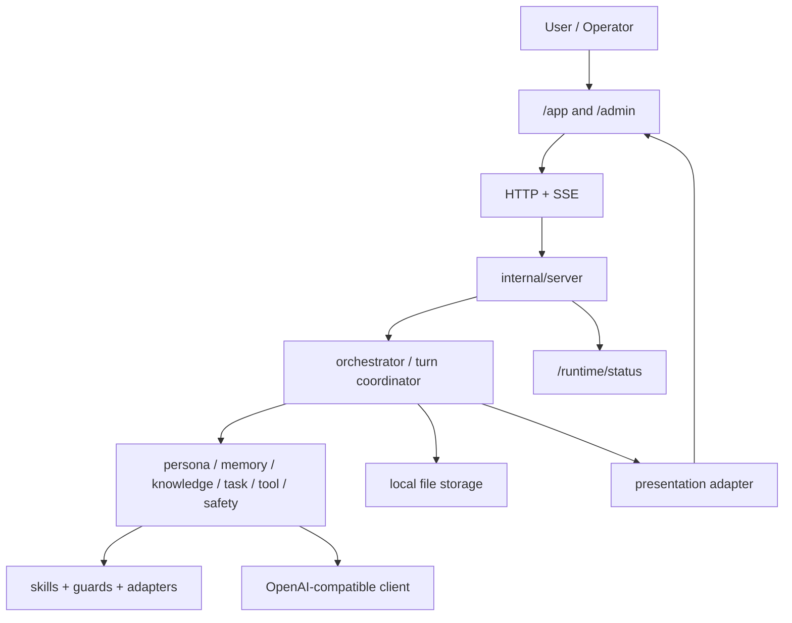

# digital-twin

Planning and implementation repo for a local-first professional digital human system in Go.

## Status

Current stage: `Phase 10 - Knowledge Base and Memory Control`

What is already working:

- local-first chat runtime with durable conversation history
- persona agent with local mode, OpenAI-compatible provider mode, and fallback policy
- streaming `/chat/stream` and `/experience/stream`
- `/app` operator-facing digital human workspace
- `/admin` local operations console
- local knowledge document lifecycle: upload, list, inspect, disable, enable, delete, and reindex
- deterministic lexical knowledge retrieval with source metadata and citations
- grounded persona replies that can surface knowledge usage and citation summaries in `/app`
- `/runtime/status` for sanitized provider diagnostics
- DeepSeek-friendly local startup and smoke scripts

What is still intentionally out of scope in this repo:

- real 3D avatar or Live2D
- real TTS / ASR providers in CI
- auth / RBAC / billing
- cloud deployment platform work
- SQLite or other DB migration in the current local-first slice

## Core ideas

- `Persona`: stable assistant identity with guardrails
- `Memory`: durable local conversation state and replay-safe attempts
- `Knowledge`: operator-managed local documents with retrieval and citations
- `Runtime`: router, agent registry, orchestrator, turn persistence
- `Provider boundary`: OpenAI-compatible LLM client with sanitized diagnostics
- `Experience`: SSE-driven web workspace with provider, fallback, and error visibility
- `Governance`: evals, decision records, audit-oriented admin surfaces

## Architecture



## Main endpoints

- `GET /health`
- `GET /ready`
- `GET /metrics`
- `GET /runtime/status`
- `GET /admin/knowledge`
- `GET /admin/knowledge/{document_id}`
- `POST /chat`
- `POST /chat/stream`
- `POST /experience/stream`
- `POST /experience/mock-voice/stream`
- `POST /admin/knowledge/upload`
- `POST /admin/knowledge/disable`
- `POST /admin/knowledge/enable`
- `POST /admin/knowledge/delete`
- `POST /admin/knowledge/reindex`
- `POST /admin/knowledge/citation-test`
- `GET /app`
- `GET /admin`

## Local quick start

Local deterministic mode:

```powershell
go run ./cmd/server
```

Then open:

- [http://localhost:8080/app](http://localhost:8080/app)
- [http://localhost:8080/admin](http://localhost:8080/admin)

DeepSeek via the OpenAI-compatible boundary:

```powershell
$env:DIGITAL_TWIN_LLM_API_KEY="your-api-key"
.\scripts\start-deepseek.ps1 -Port 18080 -FallbackPolicy fail_closed
```

Then open:

- [http://localhost:18080/app](http://localhost:18080/app)
- [http://localhost:18080/admin](http://localhost:18080/admin)

Stop the tracked server:

```powershell
.\scripts\stop-server.ps1
```

## Runtime status and fallback policy

`/runtime/status` returns sanitized session diagnostics for the web app and local operators.

Example fields:

- `environment`
- `provider`
- `model`
- `fallback_policy`
- `generation_mode_hint`
- `base_url`

Fallback policies:

- `fallback_to_local`: if the provider fails before usable output, return an explicit local fallback reply
- `fail_closed`: if the provider fails, surface the error and do not silently hide it behind a normal assistant answer

Recommended verification mode when testing DeepSeek:

```powershell
.\scripts\start-deepseek.ps1 -Port 18080 -FallbackPolicy fail_closed
```

## Smoke checks

Conversation and persistence smoke:

```powershell
.\scripts\smoke-conversation.ps1 -BaseUrl http://localhost:18080
```

The smoke script now:

- fetches `/runtime/status`
- prints a sanitized provider diagnostic
- runs two streaming turns plus one replay attempt
- verifies durable local conversation history

## Knowledge workflow

Phase 10 adds a real local knowledge loop:

1. Start the server.
2. Open [http://localhost:18080/admin](http://localhost:18080/admin).
3. Upload a mock or text/Markdown knowledge document.
4. Run a citation test query from `/admin`.
5. Ask a related question in `/app`.

When grounding succeeds, `/app` can now show:

- `Knowledge grounded`
- source citation chips
- `Memory considered` when memory metadata is present
- `No source used` when retrieval found nothing relevant

## Developer workflow

Useful commands:

```powershell
go test ./...
go vet ./...
go build ./cmd/server
go build ./cmd/cli
go build ./cmd/smoke
```

## Repo guide

- [AGENTS.md](./AGENTS.md): required SDD + TDD workflow
- [docs/specs](./docs/specs): approved feature specs
- [docs/design](./docs/design): design docs
- [docs/plans](./docs/plans): implementation plans and test matrices
- [RELEASE_NOTES.md](./RELEASE_NOTES.md): document and implementation release history

## Phase 10 highlights

Phase 10 focuses on turning the digital human into a local knowledge worker:

- `/admin` now manages real knowledge documents instead of a mock-only upload path
- ready and disabled knowledge states affect retrieval behavior
- persona chat can use deterministic lexical retrieval and emit citation metadata
- `/app` can distinguish grounded answers from source-free answers
- the implementation stays local-first and deterministic: no SQLite, no real provider calls in CI
