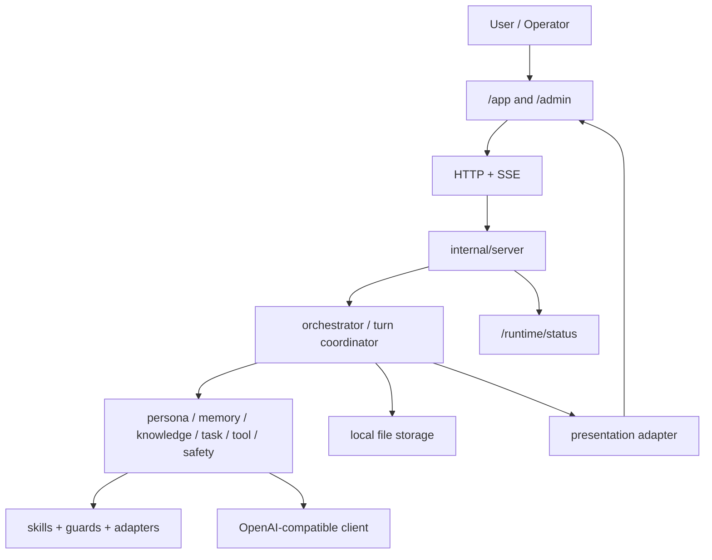

# digital-twin

Planning and implementation repo for a local-first professional digital human system in Go.

## Status

Current stage: `Phase 9 - Experience and Provider Diagnostics`

What is already working:

- local-first chat runtime with durable conversation history
- persona agent with local mode, OpenAI-compatible provider mode, and fallback policy
- streaming `/chat/stream` and `/experience/stream`
- `/app` operator-facing digital human workspace
- `/admin` local operations console
- `/runtime/status` for sanitized provider diagnostics
- DeepSeek-friendly local startup and smoke scripts

What is still intentionally out of scope in this repo:

- real 3D avatar or Live2D
- real TTS / ASR providers in CI
- auth / RBAC / billing
- cloud deployment platform work
- SQLite or other DB migration in the current local-first slice

## Core ideas

- `Persona`: stable assistant identity with guardrails
- `Memory`: durable local conversation state and replay-safe attempts
- `Runtime`: router, agent registry, orchestrator, turn persistence
- `Provider boundary`: OpenAI-compatible LLM client with sanitized diagnostics
- `Experience`: SSE-driven web workspace with provider, fallback, and error visibility
- `Governance`: evals, decision records, audit-oriented admin surfaces

## Architecture



## Main endpoints

- `GET /health`
- `GET /ready`
- `GET /metrics`
- `GET /runtime/status`
- `POST /chat`
- `POST /chat/stream`
- `POST /experience/stream`
- `POST /experience/mock-voice/stream`
- `GET /app`
- `GET /admin`

## Local quick start

Local deterministic mode:

```powershell
go run ./cmd/server
```

Then open:

- [http://localhost:8080/app](http://localhost:8080/app)
- [http://localhost:8080/admin](http://localhost:8080/admin)

DeepSeek via the OpenAI-compatible boundary:

```powershell
$env:DIGITAL_TWIN_LLM_API_KEY="your-api-key"
.\scripts\start-deepseek.ps1 -Port 18080 -FallbackPolicy fail_closed
```

Then open:

- [http://localhost:18080/app](http://localhost:18080/app)

Stop the tracked server:

```powershell
.\scripts\stop-server.ps1
```

## Runtime status and fallback policy

`/runtime/status` returns sanitized session diagnostics for the web app and local operators.

Example fields:

- `environment`
- `provider`
- `model`
- `fallback_policy`
- `generation_mode_hint`
- `base_url`

Fallback policies:

- `fallback_to_local`: if the provider fails before usable output, return an explicit local fallback reply
- `fail_closed`: if the provider fails, surface the error and do not silently hide it behind a normal assistant answer

Recommended verification mode when testing DeepSeek:

```powershell
.\scripts\start-deepseek.ps1 -Port 18080 -FallbackPolicy fail_closed
```

## Smoke checks

Conversation and persistence smoke:

```powershell
.\scripts\smoke-conversation.ps1 -BaseUrl http://localhost:18080
```

The smoke script now:

- fetches `/runtime/status`
- prints a sanitized provider diagnostic
- runs two streaming turns plus one replay attempt
- verifies durable local conversation history

## Developer workflow

Useful commands:

```powershell
go test ./...
go vet ./...
go build ./cmd/server
go build ./cmd/cli
go build ./cmd/smoke
```

## Repo guide

- [AGENTS.md](./AGENTS.md): required SDD + TDD workflow
- [docs/specs](./docs/specs): approved feature specs
- [docs/design](./docs/design): design docs
- [docs/plans](./docs/plans): implementation plans and test matrices
- [RELEASE_NOTES.md](./RELEASE_NOTES.md): document and implementation release history

## Phase 9 highlights

Phase 9 focuses on trust recovery:

- the app now looks like an operator workspace instead of a demo console
- provider and model status are visible before the first message
- fallback replies are explicitly labeled instead of masquerading as normal LLM output
- truncated, empty, malformed, and status-failure provider streams are classified
- DeepSeek startup and smoke verification are copy-paste friendly
