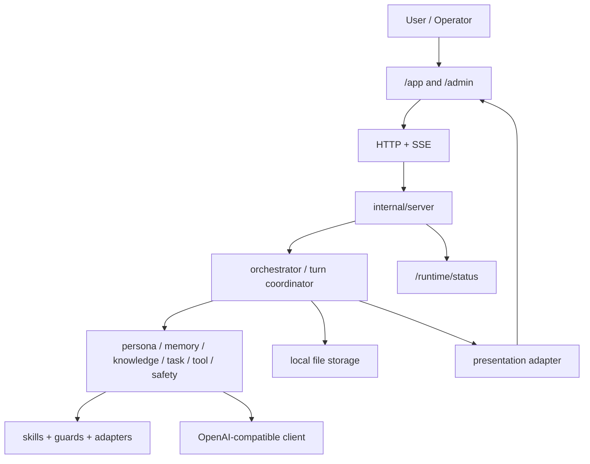

# digital-twin

Planning and implementation repo for a local-first professional digital human system in Go.

## Status

Current stage: `Phase 17 - Knowledge Curation and Source Management`

What is already working:

- local-first chat runtime with durable conversation history
- persona agent with local mode, OpenAI-compatible provider mode, and fallback policy
- streaming `/chat/stream` and `/experience/stream`
- `/app` operator-facing digital human workspace
- `/admin` local operations console
- knowledge spaces with a default local scope and per-space document membership
- local knowledge document lifecycle: upload, list, inspect, disable, enable, delete, and reindex
- deterministic lexical knowledge retrieval with source metadata and citations
- retrieval diagnostics pipeline with lexical, vector, hybrid, and auto modes
- no-source and below-threshold grounding decisions with explainable ranking metadata
- grounded persona replies that can surface knowledge-space usage and citation summaries in `/app`
- summary-first Presence panel in `/app` with bounded latest-turn takeaway and trust signals
- knowledge-space health summaries, document quality detail, retrieval debug, and local knowledge-gap queues in `/admin`
- deterministic `knowledge_answer_state` metadata for grounded, partially supported, unsupported, provider fallback, guard-rejected, and local-mode turns
- knowledge workbench actions in `/admin`: investigate gaps, create local note documents, run gap-centered diagnostics, and resolve with evidence
- knowledge curation controls in `/admin`: filter documents by space, source type, status, gap linkage, and free-text query
- knowledge document detail with source-gap and resolved-gap relationships, plus in-place local editing for curated notes and uploaded text content
- `/runtime/status` for sanitized provider diagnostics
- DeepSeek-friendly local startup and smoke scripts

What is still intentionally out of scope in this repo:

- real 3D avatar or Live2D
- real TTS / ASR providers in CI
- auth / RBAC / billing
- cloud deployment platform work
- SQLite or other DB migration in the current local-first slice

## Core ideas

- `Persona`: stable assistant identity with guardrails
- `Memory`: durable local conversation state and replay-safe attempts
- `Knowledge`: operator-managed local documents with retrieval and citations
- `Runtime`: router, agent registry, orchestrator, turn persistence
- `Provider boundary`: OpenAI-compatible LLM client with sanitized diagnostics
- `Experience`: SSE-driven web workspace with provider, fallback, and error visibility
- `Governance`: evals, decision records, audit-oriented admin surfaces

## Architecture


```mermaid
flowchart TD
    User["User / Operator"] --> Web["/app and /admin"]
    Web --> API["HTTP + SSE"]
    API --> Server["internal/server"]
    Server --> Runtime["orchestrator / turn coordinator"]
    Runtime --> Agents["persona / memory / knowledge / task / tool / safety"]
    Agents --> Skills["skills + guards + adapters"]
    Agents --> LLM["OpenAI-compatible client"]
    Runtime --> Store["local file storage"]
    Runtime --> Presentation["presentation adapter"]
    Presentation --> Web
    Server --> Status["/runtime/status"]
```

## Main endpoints

- `GET /health`
- `GET /ready`
- `GET /metrics`
- `GET /runtime/status`
- `GET /admin/knowledge`
- `GET /admin/knowledge/health`
- `GET /admin/knowledge/{document_id}`
- `GET /admin/knowledge/{document_id}/detail`
- `GET /admin/knowledge/gaps`
- `GET /admin/knowledge/spaces`
- `POST /chat`
- `POST /chat/stream`
- `POST /experience/stream`
- `POST /experience/mock-voice/stream`
- `POST /admin/knowledge/upload`
- `POST /admin/knowledge/notes/create`
- `POST /admin/knowledge/update`
- `POST /admin/knowledge/gaps/update`
- `POST /admin/knowledge/spaces/create`
- `POST /admin/knowledge/spaces/update`
- `POST /admin/knowledge/spaces/disable`
- `POST /admin/knowledge/spaces/enable`
- `POST /admin/knowledge/spaces/archive`
- `POST /admin/knowledge/disable`
- `POST /admin/knowledge/enable`
- `POST /admin/knowledge/delete`
- `POST /admin/knowledge/reindex`
- `POST /admin/knowledge/citation-test`
- `POST /admin/knowledge/retrieval-diagnostics`
- `GET /app`
- `GET /admin`

## Local quick start

Local deterministic mode:

```powershell
go run ./cmd/server
```

Then open:

- [http://localhost:8080/app](http://localhost:8080/app)
- [http://localhost:8080/admin](http://localhost:8080/admin)

DeepSeek via the OpenAI-compatible boundary:

```powershell
$env:DIGITAL_TWIN_LLM_API_KEY="your-api-key"
.\scripts\start-deepseek.ps1 -Port 18080 -FallbackPolicy fail_closed
```

Then open:

- [http://localhost:18080/app](http://localhost:18080/app)
- [http://localhost:18080/admin](http://localhost:18080/admin)

Stop the tracked server:

```powershell
.\scripts\stop-server.ps1
```

## Runtime status and fallback policy

`/runtime/status` returns sanitized session diagnostics for the web app and local operators.

Example fields:

- `environment`
- `provider`
- `model`
- `fallback_policy`
- `generation_mode_hint`
- `base_url`

Fallback policies:

- `fallback_to_local`: if the provider fails before usable output, return an explicit local fallback reply
- `fail_closed`: if the provider fails, surface the error and do not silently hide it behind a normal assistant answer

Recommended verification mode when testing DeepSeek:

```powershell
.\scripts\start-deepseek.ps1 -Port 18080 -FallbackPolicy fail_closed
```

## Smoke checks

Conversation and persistence smoke:

```powershell
.\scripts\smoke-conversation.ps1 -BaseUrl http://localhost:18080
```

The smoke script now:

- fetches `/runtime/status`
- prints a sanitized provider diagnostic
- runs two streaming turns plus one replay attempt
- verifies durable local conversation history

## Knowledge workflow

Phase 17 extends the local knowledge loop into a curation workspace:

1. Start the server.
2. Open [http://localhost:18080/admin](http://localhost:18080/admin).
3. Use the default knowledge space or create a new one.
4. Upload a mock or text/Markdown knowledge document into the selected space.
5. Filter the document table by source type, status, free-text query, or whether a document is linked to a knowledge gap.
6. Inspect document detail to see quality flags, source metadata, and source/resolution relationships.
7. Edit a local document title, source label, or content in place when curation is needed.
8. Ask a related or unsupported question in `/app` with the same selected space.
9. Return to `/admin` and inspect the local knowledge-gap queue.
10. Move a gap to `investigating`, create a workbench note, and run diagnostics from the gap question.
11. Resolve the gap with an optional document ID and resolution note once evidence is visible.

When a turn completes, `/app` can now show:

- `Knowledge grounded (Space Name)`
- `Partially supported (Space Name)` when retrieval is below threshold
- `No supporting source (Space Name)` when the selected space cannot support the question
- `Provider fallback` or `Guardrail fallback` when the final answer is not a normal provider-backed grounded turn
- source citation chips
- `Memory considered` when memory metadata is present

Local verification for Phase 17:

```powershell
go test ./internal/knowledge ./internal/admin ./internal/server ./internal/agents ./internal/app ./web
go test ./...
go vet ./...
```

The retrieval pipeline is still local-first:

- lexical retrieval is always available
- vector retrieval is optional
- CI does not require DeepSeek, embeddings, or an external vector database
- `internal/knowledge/testdata` contains deterministic RAG eval fixtures

## Phase 17 highlights

Phase 17 focuses on turning the knowledge workbench into a curation surface:

- `/admin` now supports knowledge list filtering across space, document status, source type, gap-linked state, and free-text query
- document detail now projects source-gap and resolved-gap relationships so operators can see why a note exists and what evidence it closed
- local knowledge documents can be edited in place for title, source label, and content, then reindexed through the existing deterministic pipeline

## Developer workflow

Useful commands:

```powershell
go test ./...
go vet ./...
go build ./cmd/server
go build ./cmd/cli
go build ./cmd/smoke
```

## Repo guide

- [AGENTS.md](./AGENTS.md): required SDD + TDD workflow
- [docs/specs](./docs/specs): approved feature specs
- [docs/design](./docs/design): design docs
- [docs/plans](./docs/plans): implementation plans and test matrices
- [RELEASE_NOTES.md](./RELEASE_NOTES.md): document and implementation release history

## Phase 16 highlights

Phase 16 focuses on extending the local knowledge loop into an operator workbench:

- `investigating` is now a first-class local knowledge-gap status
- `/admin` can create workbench notes that preserve `source_gap_id`, `source_type`, and local provenance metadata
- operators can run diagnostics from a gap question and resolve a gap with an optional evidence document and resolution note

## Phase 15 highlights

Phase 15 focuses on turning knowledge grounding into a visible answer-state loop:

- `PersonaAgent` now emits deterministic `knowledge_answer_state` metadata
- runtime streaming and replay allowlist the answer state for `/app`
- unsupported and partially supported turns can create one local gap without duplicate open-gap spam
- `/app` now distinguishes grounded, partial, unsupported, provider fallback, guardrail fallback, and local mode states

## Phase 14 highlights

Phase 14 focuses on turning knowledge management into an operator workflow:

- `/admin` now exposes selected-space health summaries with deterministic counts and attention reasons
- document inspection now includes quality flags such as disabled, index failed, vector missing, and duplicate content hash
- retrieval diagnostics are rendered as a structured debug workbench instead of only raw text dumps
- unsupported knowledge-scoped turns can become local knowledge-gap records that operators can ignore or resolve

## Phase 13 highlights

Phase 13 focuses on making the `/app` Presence rail more useful and less visually noisy:

- Presence now summarizes the latest assistant turn instead of behaving like a growing visual/history area
- the avatar slot is bounded so long replies do not stretch the side rail
- grounding, memory, and fallback signals remain visible as compact operational cues
- transcript remains the canonical full conversation record

## Phase 12 highlights

Phase 12 focuses on turning the knowledge base into a scoped operator workspace:

- `/admin` now manages knowledge spaces before documents
- legacy flat knowledge data is migrated into a guaranteed `default` space
- retrieval diagnostics can filter by `space_id`
- `/app` carries the selected knowledge space into grounded answers
- the implementation stays local-first and deterministic: no SQLite, no real provider calls in CI
