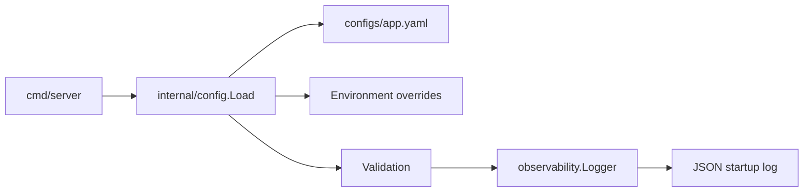

# Phase 0 Engineering Baseline Design

## Overview

Phase 0 establishes the minimum engineering system needed for small, verifiable future work. The design favors standard library implementations, stable package boundaries, and clear extension points over early dependency adoption.

## Design Decisions

### Go Module and Directory Skeleton

The module path is `github.com/nobodycan/digital-twin`. The initial tree mirrors the planned architecture from `plan.md`, but most domain packages contain only `doc.go` placeholders until their Phase arrives.

This keeps imports stable for later work while avoiding premature implementation.

### Developer Entry Points

Two command surfaces are provided:

- `Makefile` for Linux/macOS/CI and POSIX-like environments.
- `scripts/dev.ps1` for Windows PowerShell users who do not have `make`.

`make test` intentionally runs normal tests only. Race tests are split into `make test-race` because the current local environment may be `windows/386`, where Go does not support `-race`.

### Configuration

`internal/config` uses a small fixed-structure YAML subset parser instead of adding a dependency. Phase 0 only needs simple nested scalar settings from `configs/app.yaml`, so this avoids committing to a configuration library before broader needs are known.

Config values are applied in this order:

1. Built-in defaults.
2. Values from the YAML file.
3. Environment variable overrides.
4. Validation.

Supported environment variables have both unprefixed and `DIGITAL_TWIN_` forms, for example `SERVER_PORT` and `DIGITAL_TWIN_SERVER_PORT`.

The server config path is selected by:

1. `--config <path>` flag.
2. `DIGITAL_TWIN_CONFIG` environment variable.
3. Default development path `configs/app.yaml`.

Unknown config keys return errors instead of being ignored. This makes typo failures visible early.

### Observability

`internal/observability` defines narrow interfaces:

- `Logger` backed by `log/slog`.
- `Metrics` backed by a thread-safe in-memory implementation.
- `MetricsExporter` for future `/metrics` integration.
- `Tracer` and `TraceSpan` for future OpenTelemetry integration.

Phase 0 includes a Prometheus text exporter for the in-memory metrics snapshot, but it does not add Prometheus client dependencies or expose an HTTP endpoint. Real `/metrics` routing belongs to Phase 3.

The startup path logs a JSON record containing component, port, log level, tenant, TTS provider, and ASR provider. This proves config and structured logging are wired together.

### Domain Errors

`internal/core` defines sentinel errors for early domain boundaries:

- `ErrAgentNotFound`
- `ErrLLMTimeout`
- `ErrInvalidConfig`
- `ErrInvalidInput`
- `ErrUnauthorized`

`WrapError` preserves `errors.Is` compatibility, and `Result[T]` provides an optional explicit envelope for later workflows that prefer value/error objects.

### CI and Linting

CI runs on GitHub-hosted Ubuntu:

1. `make build`
2. `make test`
3. `make test-race`
4. `golangci-lint` through `golangci/golangci-lint-action@v8` pinned to `v2.4.0`
5. `make vet`

Local Windows development can use `scripts/dev.ps1 lint`, which always runs `go vet` and runs `golangci-lint` only when installed.

## Data Flow

## Failure Modes

| Failure | Behavior |
| --- | --- |
| Config file missing | Server prints `load config: ...` to stderr and exits with status 1 |
| Unknown config key | `Load` returns an error |
| Invalid server port | `Load` returns an error |
| Unsupported log level | Server falls back to info level |
| Missing `golangci-lint` locally | PowerShell lint script warns and still runs `go vet` |
| Race detector unsupported locally | `go test -race` fails with Go toolchain message; CI covers supported architecture |

## Extension Points

- Replace fixed YAML parser with a library later if config complexity grows.
- Add HTTP `/metrics` in Phase 3 using `MetricsExporter`.
- Replace `NoopTracer` with OpenTelemetry wiring when runtime spans exist.
- Expand domain errors when Phase 1 defines public data contracts and core interfaces.

## Non-Goals

- No HTTP server lifecycle yet.
- No real LLM, DB, vector store, TTS, ASR, Agent, Skill, Router, or Orchestrator implementation.
- No Docker or Kubernetes manifests beyond directory placeholders.
