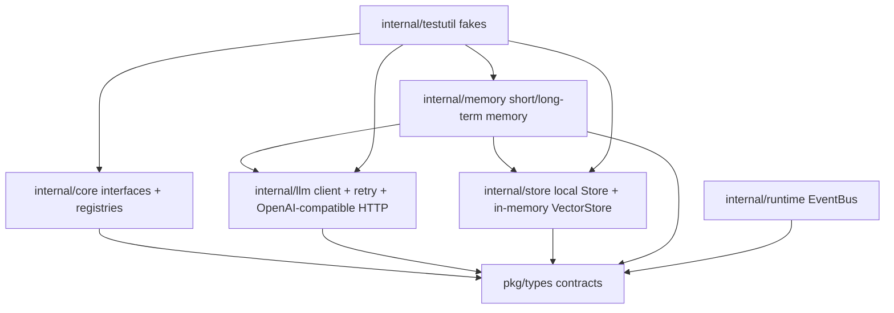
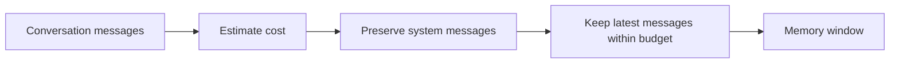
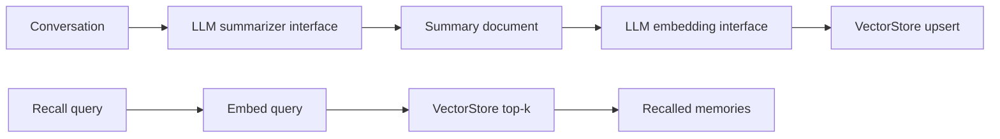

# Phase 1 Core Contracts and Infrastructure Design

## Overview

Phase 1 establishes the compile-time contract layer and local filesystem infrastructure needed by later phases. The design prioritizes deterministic tests, zero external services, small interfaces, and future provider replaceability.

## Office-Hours Review

The request says “complete the next Phase,” but `AGENTS.md` requires SDD first and code only after explicit approval. The main risk is over-building Phase 2 behavior while trying to make Phase 1 feel useful. This design therefore keeps Phase 1 intentionally boring: contracts, mocks, registries, retry wrappers, local filesystem storage, and in-memory fakes only.

Hidden assumptions surfaced:

- “SQLite 起步” in `plan.md` conflicts with the current no-dependency Phase 0 style and the current product preference. This design explicitly defers SQLite and starts with local filesystem storage behind a `Store` interface; in-memory storage is reserved for tests and fakes.
- “Token budget” cannot be exact without a tokenizer dependency. This design uses a deterministic estimator in Phase 1 and leaves model-specific tokenization for later.
- “OpenAI compatible” must not mean real API integration in tests. All tests use `httptest.Server`.
- Mock generation would add toolchain complexity. Hand-written fakes are enough for Phase 1 and easier to review.

## Architecture

## Design Decisions

### Contract Placement

Public reusable data contracts live in `pkg/types`. Internal behavior contracts live near their owning subsystem:

- Core behavior: `internal/core`
- LLM: `internal/llm`
- Memory: `internal/memory`
- Persistence/vector: `internal/store`
- Runtime events: `internal/runtime`

This avoids a single giant interfaces package while keeping package ownership clear.

### Interface Shape

All behavior interfaces must accept `context.Context`. Methods return ordinary Go `(value, error)` pairs unless a stream callback is required. Interfaces should be minimal enough that mocks are easy to hand-write.

### Mocks and Fakes

Use `internal/testutil` for shared fakes. Each fake should:

- Implement the target interface.
- Support deterministic configured responses.
- Record calls when useful for assertions.
- Avoid sleeping, goroutine leaks, and real network calls.

No `mockery` or code generation is introduced in Phase 1.

### Registry Design

Registries are simple in-memory maps guarded by mutexes. They reject duplicates and list names in sorted order. Agent lookup by intent delegates to each agent’s `CanHandle` method so Phase 2 can define richer matching without changing registry storage.

### LLM Design

The LLM package exposes a provider-neutral `Client` interface and an OpenAI-compatible HTTP implementation.

The retry wrapper is a decorator around `Client`. It handles retryable errors and respects context cancellation. Backoff is configurable and testable without long sleeps.

Streaming support is represented as a callback-based method or callback field so the client can parse SSE-like chunks without committing the rest of the runtime to a streaming abstraction yet.

### Store Design

The Phase 1 store uses local filesystem persistence. This is deliberate:

- It avoids choosing SQLite driver tradeoffs before persistence requirements are real.
- It keeps the first persisted implementation inspectable with ordinary files.
- It can run locally without background services or database setup.
- It still forces the repository to define persistence contracts clearly.

The local store writes JSON or JSONL under a configurable data directory. File layout should be deterministic by tenant, user, and conversation ID so tests and operators can inspect state easily. Full-document saves should use temp-file-plus-rename where practical; append-only message writes may use JSONL if that keeps the implementation simpler and safer.

The in-memory store remains useful as a fake in `internal/testutil`, but it is not the main Phase 1 persistence implementation.

SQLite/Postgres/object storage can replace the implementation later without changing callers.

### Vector Design

The in-memory vector store uses cosine similarity and validates vector dimensions. Equal scores are ordered deterministically by document ID. This supports reliable tests and gives KnowledgeAgent a future local dependency.

### Memory Design

Short-term memory trims conversations by a deterministic estimator and always preserves system messages.

Long-term memory composes interfaces:

- summarizer from `llm`
- embedder from `llm`
- vector storage from `store`

This keeps it testable and avoids real LLM calls.

## Data Flow

### Short-Term Memory

### Long-Term Memory

## Failure Modes

| Failure | Behavior |
| --- | --- |
| Duplicate registry name | Return duplicate error |
| Missing registry entry | Return `core.ErrAgentNotFound` or a typed not-found error |
| LLM timeout | Return wrapped `core.ErrLLMTimeout` when applicable |
| OpenAI fake server non-2xx | Return error containing status and safe response summary |
| Vector dimension mismatch | Return validation error |
| Empty vector search | Return empty result list, no error |
| Memory budget too small | Preserve system messages and include as many recent messages as fit |
| Long-term summarizer/embedder failure | Return wrapped error; do not write partial memory |

## Test Matrix

| Component | Required tests |
| --- | --- |
| `pkg/types` | JSON round trips and zero-value behavior |
| Core interfaces | Compile-time fake assertions |
| Registries | register, duplicate, list order, not found, intent lookup |
| LLM retry | success, retry, cancellation, max attempts |
| OpenAI client | request body, auth header, response parse, streaming parse |
| Store | conversation CRUD, message append/list, missing conversation, reopen persisted files, corrupt file handling |
| Vector store | upsert, top-k, dimension mismatch, tie ordering |
| Short-term memory | trimming, system preservation, empty conversation |
| Long-term memory | summarize+embed+upsert, query recall, failure handling |

## Non-Goals

- No Phase 2 persona or routing behavior.
- No SQLite or real persistent database server.
- No real external LLM calls.
- No production HTTP API.
- No generated mocks.
