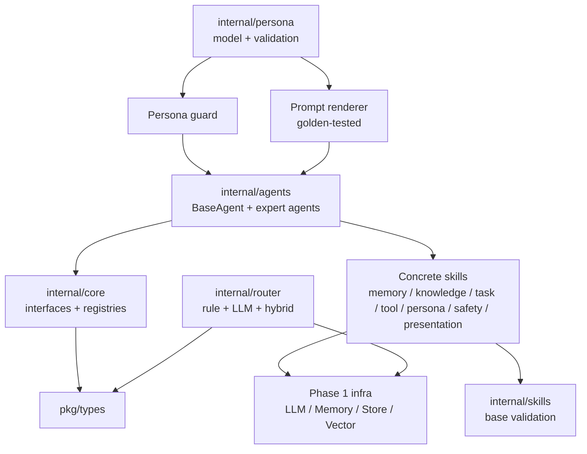
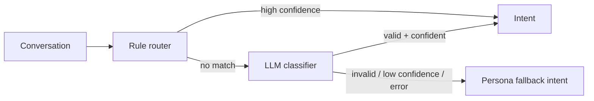
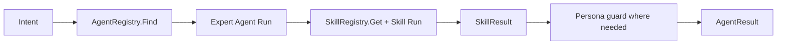

# Phase 2 Persona, Router, Skills, and Agents Design

## Overview

Phase 2 is the first point where `digital-twin` begins to behave like a professional digital person instead of only a set of contracts. The design keeps that ambition grounded: persona, routing, skills, and agents are implemented as small deterministic pieces on top of Phase 1 contracts, with no real external providers required in tests.

## Office-Hours Review

The user asked to proceed with Phase 2 under `AGENTS.md`, which means Stage 1 must use SDD and stop before code. The requirement is broad enough to accidentally turn into a full runtime, so this design narrows Phase 2 to the intelligence layer only:

- Persona and prompt stability.
- Intent routing.
- Atomic skills.
- Expert agents.

Hidden assumptions surfaced:

- The existing contract method is `Agent.Run`, not `Agent.Handle`; Phase 2 must follow the actual Phase 1 interface.
- “Skill 库” could become real provider integration. In Phase 2, high-risk skills must be local deterministic implementations or provider-shaped fakes.
- “人格一致性” cannot be proven by one prompt. It needs a model, renderer, guard, golden tests, and failure behavior.
- The user has said they do not want SQLite now. Phase 2 continues using Phase 1 local store and in-memory/vector abstractions only.
- Phase 2 should not leak into Phase 3. Orchestrator, HTTP, SSE, and full conversation runtime remain out of scope.

## Premises

1. Persona is a first-class model, not a hard-coded system prompt.
2. Routing should be hybrid: cheap deterministic rules first, LLM classification only when rules are insufficient.
3. Skills should be boring and small, because agents become easier to test when capabilities are atomic.
4. Agents should compose skills and contracts; they should not own infrastructure directly when a skill can express the operation.
5. All provider-like behavior must be mockable and deterministic until Phase 3+ runtime proves where real integration is needed.

## Approaches Considered

### Approach A: Minimal Vertical Slice

Implement only persona, hybrid router, `PersonaAgent`, and a tiny skill framework, then defer the rest of M4/M5.

Pros:

- Fastest route to a visible conversational behavior.
- Lower short-term test surface.
- Easier to review in one small PR.

Cons:

- Leaves Phase 2 only partially complete.
- Later agents may force skill framework redesign.
- Does not satisfy the Phase 2 acceptance table in `plan.md`.

### Approach B: Framework First, Then Thin Complete Set

Implement persona, prompt rendering, guard, routers, skill framework, all named skill categories as deterministic local implementations or fakes, and all expert agents as thin orchestrators over those skills.

Pros:

- Satisfies Phase 2 as planned while keeping safety intent consumable.
- Preserves small, testable units.
- Lets Phase 3 orchestrator rely on stable router/agent/skill behavior.
- Avoids real provider decisions too early.

Cons:

- More files and tests.
- Requires careful sequencing to avoid a large tangled change.
- Some skills will be intentionally shallow until real providers arrive.

### Approach C: Agent-Centric Implementation

Build each expert agent with embedded behavior first, and extract skills later.

Pros:

- Fewer abstractions at the beginning.
- Simple to demo agent responses.

Cons:

- Violates the Phase 2 plan’s Skill-first reuse goal.
- Makes TDD harder because dependencies hide inside agents.
- Increases rewrite risk before Phase 3.

## Recommended Approach

Use Approach B: framework first, then a thin complete set.

The key is “thin complete,” not “fully productized.” Every named router, skill, and agent should exist with deterministic tests, but provider-heavy behavior stays behind fakes, allowlists, and local implementations. This gives Phase 3 a stable surface while keeping Phase 2 reviewable.

## Architecture

## Data Flow

### Routing

### Agent Execution

## Package Design

### `internal/persona`

Owns persona data, validation, rendering, and consistency checks. Keeping it separate from `internal/agents` prevents persona rules from becoming agent-specific and makes prompt golden tests straightforward.

### `internal/router`

Owns routing only. Routers should return `types.Intent`; they should not execute skills or agents. Metadata should capture source such as `rule`, `llm`, or `fallback` so Phase 3 observability can expose routing behavior.

### `internal/skills`

Owns skill base helpers and concrete skills. A simple internal validator is preferred over a schema dependency for Phase 2. If validation complexity grows, Stage 2 can explicitly approve a small schema library.

### `internal/agents`

Owns agent composition. Agents should be thin: classify whether they can handle an intent, call the required skills, and produce `types.AgentResult`.

## Failure Modes

| Failure | Behavior |
| --- | --- |
| Invalid persona config | Return validation error with field/context |
| Prompt renderer missing variable | Use explicit default or return validation error; never silently render `<no value>` |
| Persona guard fails | Return structured guard failure and safe fallback metadata |
| Rule router ambiguous match | Choose highest-priority rule deterministically and record metadata |
| LLM router invalid JSON | Fall back to persona/unknown intent with low confidence |
| LLM provider failure | Return fallback intent unless context is canceled |
| Missing skill | Agent returns wrapped `ErrSkillNotFound` or safe fallback result depending on agent |
| Invalid skill params | Skill returns validation error without side effects |
| Tool target not allowlisted | Deny by default and record denial reason |
| Agent dependency failure | Return safe assistant message with error metadata; do not panic |

## Test Matrix

| Component | Required tests |
| --- | --- |
| Persona model | valid config, missing identity, invalid boundaries, metadata preservation |
| Prompt renderer | golden output, sorted fields, injected clock, missing variable |
| Persona guard | allowed output, forbidden claim, uncertainty requirement, safe fallback |
| Rule router | knowledge/memory/task/tool/persona matches and priority |
| LLM router | fake LLM valid JSON, invalid JSON, low confidence, provider error |
| Hybrid router | rule hit, LLM fallback, final persona fallback |
| Skill base | required fields, type mismatch, defaults, error metadata |
| Skills | valid, invalid, dependency failure for every concrete skill |
| BaseAgent | interface satisfaction, result helper, missing skill behavior |
| Expert agents | `CanHandle`, `Run`, registry registration, dependency failure |

## Small-Step Execution Plan

Stage 2 autoplan should convert this into an executable checklist, but the recommended build order is:

1. Persona model and validation.
2. Prompt renderer and golden tests.
3. Persona guard.
4. Rule router.
5. LLM router.
6. Hybrid router.
7. Skill base validation framework.
8. Memory, knowledge, task, tool, persona, safety, and presentation skills in separate small steps.
9. BaseAgent.
10. PersonaAgent, MemoryAgent, KnowledgeAgent, TaskAgent, ToolAgent, and SafetyAgent in separate small steps.
11. Final docs and release notes update.

Parallelizable work after the skill base lands:

- Memory and knowledge skills can proceed separately.
- Persona and safety skills can proceed separately.
- Task and presentation skills can proceed separately.
- Expert agents can proceed separately after BaseAgent plus their required skills exist.

## Success Criteria

Phase 2 is done when:

- The acceptance criteria in `docs/specs/phase-2-persona-router-skills-agents.md` are satisfied.
- `go test ./...`, `go vet ./...`, and `go build ./cmd/server` pass.
- The README no longer says Phase 2 business behavior is absent.
- Release notes describe real implemented behavior without claiming Phase 3 runtime/API capability.

## Open Questions

- Should `pkg/types` add explicit persona/small-talk intent names, or should Phase 2 encode persona fallback as `IntentUnknown` with metadata? Recommendation: add explicit intent names only when the first router test requires clearer semantics.
- Should skill validation remain hand-written or adopt JSON Schema? Recommendation: start hand-written in Phase 2 and revisit after at least five skills reveal repeated validation patterns.
- How deep should provider-shaped skills be? Recommendation: keep them deterministic and local in Phase 2; real providers belong after runtime and security review.

## Distribution Plan

No end-user distribution changes in Phase 2. The deliverable is committed repository code and documentation. Existing local commands remain the verification path:

- `go test ./...`
- `go vet ./...`
- `go build ./cmd/server`

## Next Steps

1. User approves this Stage 1 spec.
2. Stage 2 runs autoplan against this spec/design and produces `docs/plans/phase-2-persona-router-skills-agents-plan.md`.
3. User approves the plan.
4. Stage 3 begins TDD implementation with RED -> GREEN -> REFACTOR for each small step.
