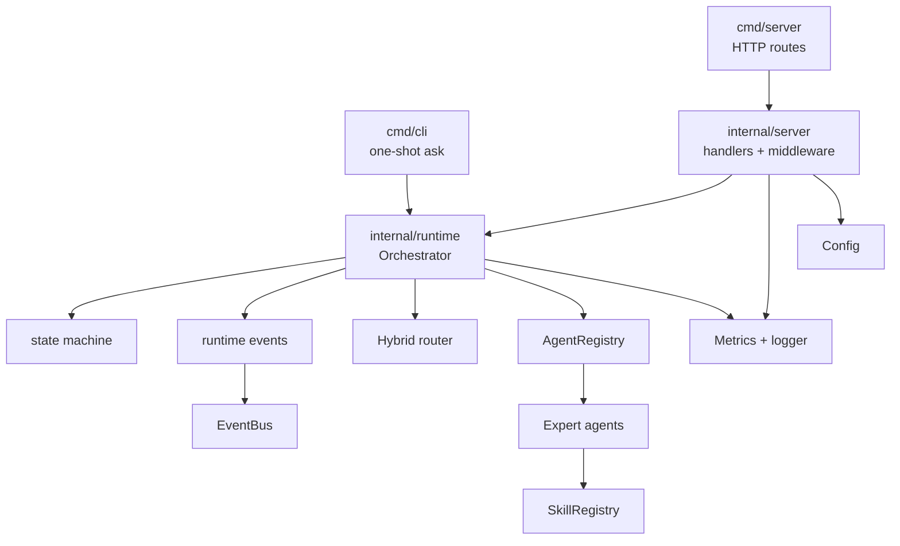
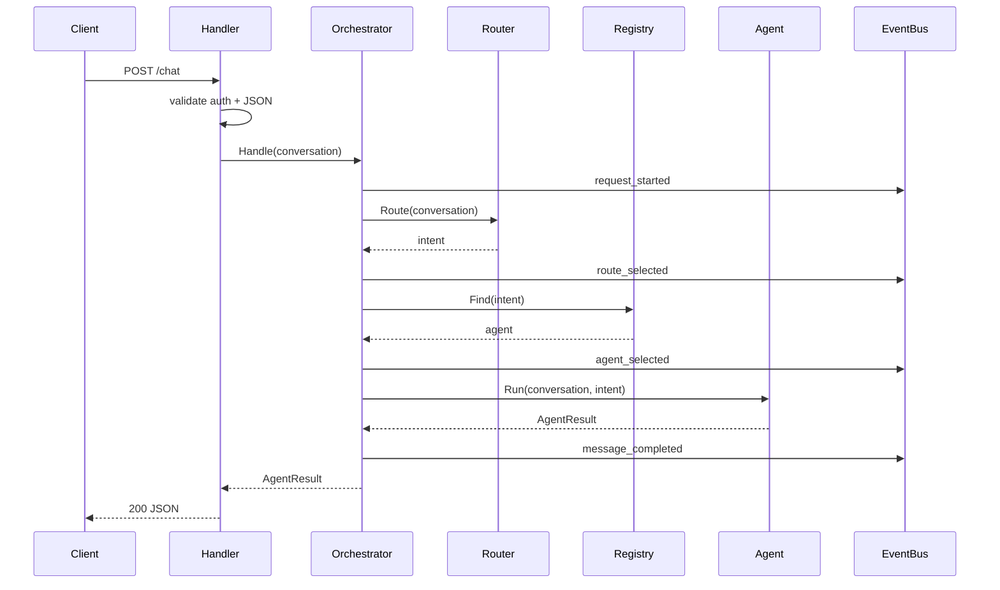
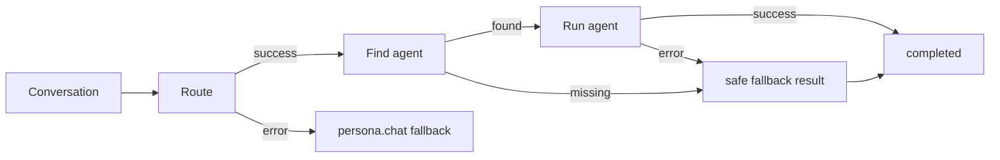

# Phase 3 Orchestrator Runtime and API Design

## Overview

Phase 3 is where `digital-twin` becomes callable as a local product surface instead of a set of internal capabilities. The goal is not to build the final digital-human experience; it is to wire the already-built persona, router, skills, and expert agents into a reliable runtime that can be exercised through CLI and HTTP.

The design keeps Phase 3 intentionally local and deterministic:

- No SQLite for now, matching the user's stated preference.
- No real external providers in tests.
- No Web UI, avatar, real TTS, or real ASR.
- HTTP and SSE are production-shaped but backed by local deterministic components.

## Office-Hours Review

The user asked to proceed with Phase 3 under `AGENTS.md`, which means Stage 1 must use SDD and stop before implementation. The requirement is broad enough to accidentally become "build the whole product," so this design narrows Phase 3 to runtime and entrypoints:

- Orchestrator main loop.
- Session state machine.
- Runtime events and observability.
- CLI one-shot entry.
- HTTP `/health`, `/metrics`, `/chat`, and optional SSE stream.
- Minimal API key auth and in-memory rate limiting.
- Local deterministic e2e path.

Hidden assumptions surfaced:

- The current `core.Orchestrator` interface returns one `types.AgentResult`; streaming must be layered through events/SSE, not by changing the core interface casually.
- HTTP `/chat` should not require the final UI or avatar event model. Phase 4 owns the full experience layer.
- "Concurrent scheduling" does not imply distributed jobs. For Phase 3, goroutine-safe per-request execution is enough unless Stage 2 proves a real need for fan-out.
- API authentication should be minimal and testable. API key middleware is appropriate; JWT can wait.
- Local storage may be used for snapshots only if approved in Stage 2. The default runtime should remain mostly stateless.
- The existing Phase 2 agents are deterministic and thin. Phase 3 should compose them rather than rewriting agent behavior inside the orchestrator.

## Premise Challenge

| Premise | Challenge | Decision |
| --- | --- | --- |
| Phase 3 must ship both CLI and HTTP | Doing both can split focus | Keep both, but make CLI one-shot and HTTP minimal; REPL and gRPC stay optional |
| SSE must stream real token deltas | Current agents return complete results | Stream runtime events and final message chunks first; real token deltas can arrive with provider streaming later |
| Orchestrator should own all fallback behavior | Agents already own some safe messages | Orchestrator owns routing/agent failure fallback; agents keep domain-level fallbacks |
| Concurrency needs a scheduler | There is no long-running job model yet | Test goroutine-safe concurrent requests before adding scheduler abstractions |
| Auth needs JWT | Phase 3 is local/runtime first | API key auth and in-memory rate limiting are enough |

## Approaches Considered

### Approach A: CLI-First Vertical Slice

Build a production orchestrator and CLI one-shot command first, defer HTTP and SSE.

Pros:

- Smallest runtime surface.
- Fastest proof that Phase 2 pieces work together.
- Easy local debugging.

Cons:

- Does not satisfy Phase 3 M7 HTTP/API acceptance.
- Delays auth, rate limiting, and handler test patterns.
- Leaves frontend-facing integration unknown until later.

### Approach B: Runtime Core Plus Minimal HTTP

Build orchestrator, state machine, events, CLI one-shot, HTTP `/health`, `/metrics`, `/chat`, minimal auth/rate limit, and optional SSE as event streaming.

Pros:

- Satisfies Phase 3 without claiming Phase 4 UI behavior.
- Keeps runtime reusable by both CLI and HTTP.
- Tests the real integration boundary early.
- Gives later web/avatar work a stable API surface.

Cons:

- More test surface than CLI-only.
- Requires careful package boundaries to keep `cmd/server` thin.
- SSE must be explicitly scoped to runtime events, not real token streaming.

### Approach C: HTTP-First Product API

Build the HTTP API as the main runtime and make CLI call HTTP internally.

Pros:

- One public integration path.
- Closest to how later UI will call the backend.

Cons:

- Makes local CLI dependent on server lifecycle.
- Encourages handler-level orchestration logic.
- Harder to unit-test orchestration independent of transport.

## Recommended Approach

Use Approach B: runtime core plus minimal HTTP.

The runtime should be transport-independent. CLI and HTTP should be thin adapters around the same orchestrator. SSE should initially expose structured runtime events and final message output, not pretend real LLM token streaming exists.

## Architecture

## Data Flow

### Non-Streaming Chat

### Fallback

## Package Design

### `internal/runtime`

Owns orchestration, request lifecycle, state transitions, runtime events, and failure policy. It should not know about HTTP headers, CLI flags, or JSON response codes.

Recommended types:

- `Orchestrator`
- `OrchestratorConfig`
- `State`
- `Transition`
- `RuntimeEvent`
- `EventRecorder`

### `internal/server`

Owns transport concerns:

- HTTP route registration.
- Request/response structs.
- JSON validation.
- API key middleware.
- In-memory rate limit middleware.
- SSE encoding.

Handlers should call `core.Orchestrator` and not duplicate routing logic.

### `cmd/server`

Only loads config, builds dependencies, registers routes, starts the HTTP server, and handles shutdown.

### `cmd/cli`

Loads config and runs one deterministic local request path. A REPL can be added later if Stage 2 keeps it in the plan.

## Failure Modes

| Failure | Behavior |
| --- | --- |
| Empty conversation or missing user message | Return validation error before routing |
| Router returns error | Emit `runtime_error`, route to persona fallback if context is still valid |
| Router returns low confidence | Route to persona fallback and record confidence metadata |
| Agent missing | Return safe fallback result with `agent_not_found` metadata |
| Agent returns error | Return safe fallback result with failed agent metadata |
| Context canceled | Return context error and emit canceled event |
| Runtime panic | Recover, emit runtime error, return wrapped failure |
| HTTP invalid JSON | `400` with structured error |
| HTTP unauthorized | `401` |
| HTTP rate limited | `429` |
| SSE client disconnect | Stop streaming without leaking goroutines |

## Test Matrix

| Component | Required tests |
| --- | --- |
| Orchestrator | success path, router fallback, missing agent, agent error, context cancellation, panic recovery |
| State machine | valid transitions, invalid transitions, terminal state behavior |
| Runtime events | event order, correlation IDs, error metadata |
| Concurrent requests | isolated results and no shared metadata mutation |
| CLI | one-shot success, invalid input, runtime failure exit code |
| HTTP handlers | `/health`, `/metrics`, `/chat`, invalid JSON, method not allowed |
| Middleware | API key auth, disabled auth, rate limit allow/deny |
| SSE | event encoding, `done`, client cancellation if included |
| E2E | local deterministic conversation through CLI or `httptest` HTTP server |

## Small-Step Execution Guidance

Stage 2 autoplan should convert this design into the approved executable checklist. Recommended build order:

1. Runtime event types and state machine.
2. Orchestrator success path with fake router and fake agent.
3. Orchestrator fallback/error paths.
4. Runtime concurrency and event correlation tests.
5. Dependency bootstrap for local deterministic runtime.
6. CLI one-shot command.
7. HTTP `/health` and `/metrics`.
8. HTTP `/chat`.
9. Auth and rate limit middleware.
10. SSE event stream if retained.
11. E2E tests.
12. Docs, release notes, and ADR.

Parallelizable work after the orchestrator core lands:

- CLI adapter and HTTP handlers can proceed separately.
- Auth/rate-limit middleware can proceed separately from SSE.
- Docs/ADR can proceed while endpoint tests stabilize.

## Success Criteria

Phase 3 is done when:

- The acceptance criteria in `docs/specs/phase-3-orchestrator-runtime-api.md` are satisfied.
- `go test ./...`, `go vet ./...`, `go build ./cmd/server`, and `go build ./cmd/cli` pass.
- GitHub CI is green.
- README describes Phase 3 as complete without claiming Phase 4 UI/avatar/voice behavior.
- Release notes describe real implemented runtime/API behavior only.

## Open Questions For Stage 2

1. Should SSE be required in Phase 3, or treated as an optional task after `/chat` is stable?
   Recommendation: keep SSE in Phase 3, but stream runtime events rather than real token deltas.
2. Should CLI include a REPL now?
   Recommendation: start with one-shot `ask`; add REPL only if the plan has spare capacity.
3. Should gRPC stay in scope?
   Recommendation: defer gRPC. HTTP/SSE is enough for Phase 4 web/avatar work.
4. Should local conversation snapshots be persisted?
   Recommendation: default to stateless runtime; persist only if e2e or debugging needs it.

## Distribution Plan

No production deploy is required in Phase 3. The deliverable is committed repository code, local commands, HTTP handlers, tests, and documentation. Local verification commands should include:

- `go test ./...`
- `go vet ./...`
- `go build ./cmd/server`
- `go build ./cmd/cli`
- `curl /health` and `curl /chat` against local server, if Stage 3 starts the server during QA

## Next Steps

1. User approves this Stage 1 spec.
2. Stage 2 runs `$gstack-autoplan` against this spec/design and produces `docs/plans/phase-3-orchestrator-runtime-api-plan.md`.
3. User approves the plan.
4. Stage 3 begins Superpowers TDD implementation with RED -> GREEN -> REFACTOR for each small step.

