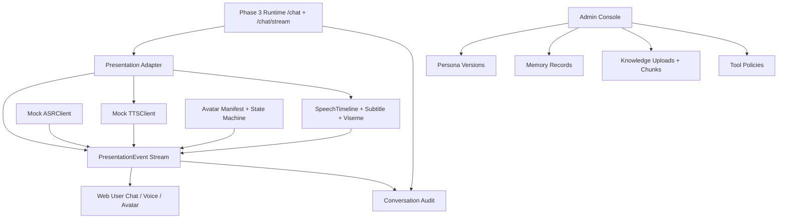
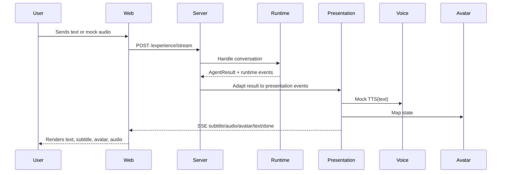
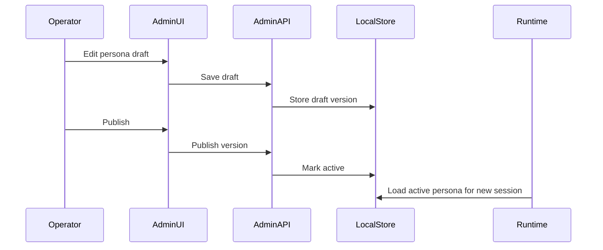

# Phase 4 Digital Human Experience and Admin Design

## Overview

Phase 4 is the moment `digital-twin` stops being only a runtime and starts becoming a product. The product promise is not "an API that returns a message"; it is a professional digital human that users can see, hear, interrupt, and trust, and that operators can configure and govern.

The design keeps the first Phase 4 implementation mock-first:

- No SQLite for now, continuing the user's stated local-storage preference.
- No real TTS/ASR/avatar provider requirement in tests.
- No marketing landing page; the first screen should be the usable chat/digital-human experience.
- Admin features should be thin but real: publish, delete, upload, configure, audit.

## Office-Hours Review

The user asked to proceed with Phase 4 under `AGENTS.md`, so this is Stage 1 SDD only. The existing `plan.md` is detailed enough to skip broad discovery questions, but the premises still need pressure-testing.

Hidden assumptions surfaced:

- "Digital human" can easily become a provider integration project. For Phase 4, the core product asset is the protocol and UI behavior, not a specific TTS/ASR/avatar vendor.
- A Web UI without admin controls would prove the user experience but not the "professional" operating model.
- A full admin console without a user-facing digital-human surface would turn Phase 4 into a CRUD detour.
- Real microphone and audio playback can introduce browser-permission friction before the product contract is stable. Mock voice should come first, with real capture behind a later gate.
- The Phase 3 SSE boundary is good enough for first streaming, but Phase 4 needs a product-level presentation event envelope on top of runtime events.
- Local file storage is sufficient for deterministic Phase 4 tests, but admin actions must be modeled as versioned records so they can later move to a database.
- The project has no frontend toolchain today. Introducing one is a real architectural choice, not a default.

## Premise Challenge

| Premise | Challenge | Decision |
| --- | --- | --- |
| Phase 4 should add real TTS/ASR providers | Provider work is expensive and unstable before protocol/UI is settled | Start with deterministic mock TTS/ASR, leave real providers as adapters |
| Avatar should be visually impressive immediately | Polished 3D can consume the phase and hide weak interaction design | Start with manifest-driven 2D/placeholder avatar states |
| Web UI and admin should be separate apps | Splitting too early doubles routing/build/deploy work | Prefer one app with user/admin routes unless Stage 2 proves otherwise |
| Admin can wait until after user UI | Professional digital humans need configuration and correction from day one | Include a minimal admin loop in Phase 4 |
| Voice requires real microphone capture | Browser permissions and device variance are brittle for first tests | Implement mock/upload/simulated voice first, then optional capture |
| Phase 4 should persist everything in SQLite | User has said not to use SQLite for now | Use local file storage and in-memory fakes |

## Approaches Considered

### Approach A: Visual-First Digital Human

Build the Web avatar/voice interface first, with a placeholder admin story.

Pros:

- Highest immediate demo value.
- Makes the project feel like a digital human quickly.
- Provides early feedback on streaming and avatar state design.

Cons:

- Risks becoming a visual shell without operator control.
- Persona/memory/knowledge/tool behavior remains hard to configure.
- Weakens Phase 5 governance because there is no admin data trail.

### Approach B: Protocol-First Product Slice

Build presentation events, mock TTS/ASR, subtitle timeline, avatar state machine, then user UI and a minimal admin console over those same contracts.

Pros:

- Gives Web and admin surfaces a shared contract.
- Keeps provider integrations swappable.
- Covers the minimum user and operator loop.
- Best fit for TDD because models, adapters, and UI states can be tested independently.

Cons:

- Less visually flashy at the beginning.
- Requires disciplined event naming and state modeling.
- Needs Stage 2 to prevent scope creep across many modules.

### Approach C: Admin-First Operations Console

Build persona, memory, knowledge, and tool management first, then add user-facing digital-human UI later.

Pros:

- Strong foundation for governance and later Phase 5.
- Easier to keep local-first and testable.
- Clarifies versioning and audit concepts early.

Cons:

- Does not satisfy M8's user-perceived digital-human goal.
- Delays voice/avatar/subtitle feedback.
- Risks building admin around abstractions that the user UI later invalidates.

### Approach D: Provider Integration First

Integrate a real TTS or ASR provider early and build the UI around it.

Pros:

- More realistic audio behavior.
- Reveals provider latency and streaming constraints.
- Useful if the product must demo real voice very soon.

Cons:

- Breaks deterministic tests unless heavily mocked.
- Introduces secrets, cost, network instability, and provider lock-in.
- Does not solve admin, persona publishing, or memory/knowledge management.

## Recommended Approach

Use Approach B: protocol-first product slice.

The key move is to define a product-level `PresentationEvent` stream that Phase 4 owns. Phase 3 runtime events explain what the backend is doing; Phase 4 presentation events explain what the user should see and hear. The Web client should render these events directly. Admin features should also write versioned local records that the runtime can consume.

## Architecture

## Package Boundaries

### `internal/presentation`

Owns transport-neutral presentation types:

- `PresentationEvent`
- `PresentationEventName`
- `SpeechTimeline`
- `SubtitleSegment`
- `AudioChunk`
- `AvatarState`
- `InterruptionPolicy`

It should not import `net/http` or Web UI code.

### `internal/voice`

Owns TTS/ASR contracts and deterministic local implementations:

- `TTSClient`
- `ASRClient`
- `MockTTSClient`
- `MockASRClient`

Real provider adapters can live here later behind the same interfaces.

### `internal/avatar`

Owns avatar manifests, validation, and state transitions.

### `internal/admin`

Owns admin application services for persona versions, memory controls, knowledge uploads, tool policies, and audit query models. It should use existing `store.Store` abstractions or local file repositories.

### `internal/server`

Extends HTTP routes and SSE output, but should remain a thin adapter. It should not contain persona publish rules, memory deletion semantics, or timeline logic.

### `web/`

Owns the user and admin UI. Stage 2 must decide whether this is:

- Go-served static HTML/CSS/TypeScript, or
- A dedicated frontend app with its own toolchain.

Given the current repo has no frontend dependencies, the default recommendation is to start simple and only introduce a frontend build pipeline if Stage 2 identifies a clear need.

## Data Flow

## Admin Flow

## UX Direction

The first screen should be the working digital-human console:

- Left or center: active conversation with streamed assistant text.
- Right: avatar panel with visible state changes and subtitle area.
- Bottom: text input plus mock voice controls.
- Secondary navigation: admin routes for persona, memory, knowledge, tools, audit.

Operational/SaaS surfaces should stay dense, quiet, and readable. Avoid landing-page hero treatment, decorative cards, and vague marketing copy.

## Failure and Edge Cases

| Case | Product behavior |
| --- | --- |
| Runtime error | Show recoverable error state, emit `error`, keep retry available |
| TTS failure | Continue text/subtitle/avatar, mark audio unavailable |
| ASR failure | Let user retry voice or switch to text |
| Avatar manifest invalid | Fall back to voice-only/idle state |
| Admin publish invalid persona | Keep draft, show validation errors |
| Memory deletion | Remove/disable and invalidate recall cache |
| Knowledge upload parse failure | Preserve prior active knowledge version |
| Tool policy denies call | Surface refusal and audit the denial |
| Stream disconnect | Cancel presentation work and mark audit as cancelled |
| User interruption | Emit `interrupted`, stop mock TTS, start new turn |

## Test Strategy

1. Unit-test presentation event construction and ordering.
2. Unit-test avatar manifest validation and state transitions.
3. Unit-test mock TTS/ASR determinism.
4. Unit-test speech timeline segmentation and viseme generation.
5. Integration-test runtime result to presentation stream.
6. Handler-test SSE routes and cancellation paths.
7. Browser QA-test the Web user flow with text and mock voice.
8. Browser QA-test admin publish/delete/upload/configure/audit flows.
9. Regression-test each bug found by QA before fixing.

## Recommended Stage 2 Planning Slices

Stage 2 should split Phase 4 into small implementation slices:

1. Presentation event model and adapter.
2. Avatar manifest and state machine.
3. Mock TTS/ASR and speech timeline.
4. Web user chat rendering text/subtitle/avatar.
5. Mock voice interaction and interruption.
6. Persona admin versioning.
7. Memory admin controls.
8. Knowledge upload and citation preview.
9. Tool permission editor.
10. Conversation audit dashboard.
11. Documentation and release notes.

## The Assignment

Before Stage 2 planning, decide the frontend strategy explicitly:

- Option A: start with Go-served static Web UI for the first Phase 4 slice.
- Option B: introduce a dedicated frontend toolchain now.

Recommendation: choose Option A unless Stage 2 identifies a concrete need for a richer framework. The project needs a product loop more than it needs frontend infrastructure.

## Open Questions

1. Should Phase 4 wait for PR #3's `/chat/stream` runtime-event polish to be merged, or should Stage 2 include an equivalent prerequisite?
2. Should admin APIs be built before admin UI screens, or should each admin module ship API + UI together?
3. Should mock voice be represented by file upload, scripted transcript chunks, or browser microphone capture first?
4. What is the first avatar type: 2D manifest with placeholder asset, voice-only, or simple CSS/Canvas state panel?
5. Should persona publishing affect only new conversations, or should active conversations be allowed to opt into a new persona version?
