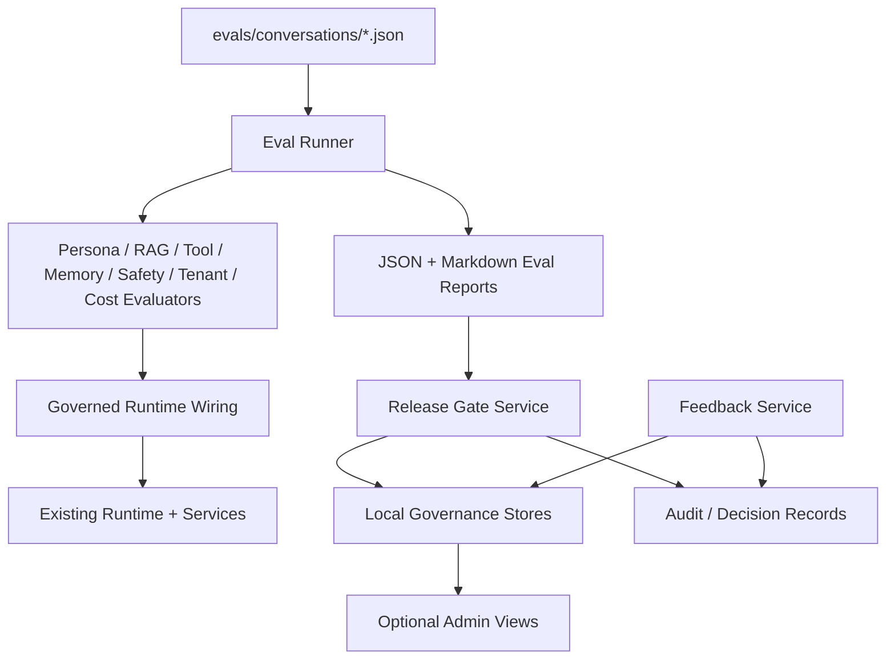
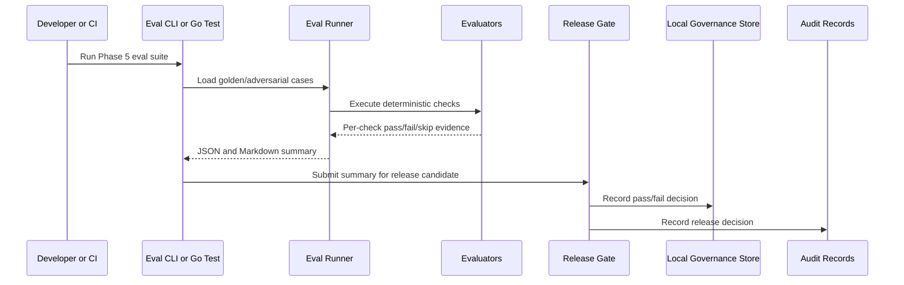

# Phase 5 Governance, Evaluation, Security, and Operations Design

## Overview

Phase 5 should make `digital-twin` harder to fool, easier to audit, and safer to change. The system already has a local product loop: a runtime, digital-human stream, Web console, operations console, local admin stores, and audit records. Phase 5 turns that loop into an operating discipline.

The design keeps the first Phase 5 implementation local-first and deterministic:

- No SQLite for now, continuing the user's stated local-storage preference.
- No mandatory external eval platform or cloud moderation provider.
- No mandatory LLM judge in CI.
- No production RBAC/OAuth expansion unless a later gate explicitly scopes it.
- Every governance feature should produce testable evidence, not just dashboard text.
- Runtime wiring is part of governance. A release gate that evaluates bootstrap defaults while operators publish different persona/tool/knowledge settings is not a real gate.

## Premise Challenge

| Premise | Challenge | Decision |
| --- | --- | --- |
| Phase 5 should build a governance dashboard | Dashboards without enforcement create a false sense of safety | Start with executable eval and release gates, then expose results |
| Eval should use LLM-as-judge immediately | LLM judges add cost, flakiness, and prompt-management risk | Baseline deterministic evaluators first; optional judge adapter later |
| Safety means content moderation | Digital-human safety also includes memory, tools, tenants, prompt injection, release rollback, and disclosure | Treat safety as policy decisions across runtime and operations |
| Admin audit is enough | Conversation audit does not capture eval, release, rollback, or feedback decisions | Add explicit governance records |
| More eval cases means better eval | Weak cases produce noise and slow iteration | Start with small golden + adversarial set and clear thresholds |
| Release gates require production infrastructure | Local records and CLI gates can prove the contract first | Keep v1 local-file and test-driven |
| Eval runner can come before runtime wiring | It would evaluate a system path that operators are not actually changing | Build runner skeleton and runtime governance wiring together |

## Approaches Considered

### Approach A: Eval Runner First

Build golden conversations, deterministic evaluators, reports, and CLI/test execution first. Add release gates and admin surfaces after the eval contract is useful.

Pros:

- Fastest path to measurable Phase 5 behavior.
- Works within local storage and CI constraints.
- Creates reusable evidence for persona, RAG, tools, memory, and safety.
- Keeps scope small enough for TDD.

Cons:

- Operators do not immediately get a rich UI.
- Release rollback and feedback are delayed.
- Requires careful fixture design to avoid shallow tests.

### Approach B: Governance Platform Slice

Build eval runner, release gate, feedback records, and admin views in one broad slice.

Pros:

- Best product narrative for operators.
- Shows the full governance loop early.
- Creates visible value in `/admin`.

Cons:

- Large blast radius across server, admin, stores, Web, and docs.
- Higher risk of half-implemented gates.
- Harder to preserve strict RED/GREEN/REFACTOR discipline.

### Approach C: Security and Privacy First

Focus on memory policy, prompt injection, high-risk content, and tenant isolation before building eval reporting.

Pros:

- Directly addresses the most dangerous production risks.
- Reuses existing safety/tool skills.
- Can be tested deterministically.

Cons:

- Without eval runner, evidence is scattered across unit tests.
- Release gate still lacks a unified pass/fail artifact.
- Product operators cannot see governance status holistically.

### Approach D: Release Gate First

Implement release candidates, publish gates, rollback records, and admin controls first, then plug evals in.

Pros:

- Directly protects persona/prompt/knowledge/tool changes.
- Builds on Phase 4 admin publish/rollback.
- Gives a concrete operational milestone.

Cons:

- A gate without mature evals is mostly plumbing.
- Risks hard-coding publish semantics too early.
- May force UI work before the evaluation model is stable.

## Recommendation

Use a staged version of Approach A, with enough release-gate modeling to prevent rework:

1. Define eval fixture and result contracts.
2. Prove governed runtime wiring for at least the first operator-controlled surface.
3. Implement deterministic evaluator services.
4. Implement a local eval runner and reports.
5. Add release gate records that consume eval summaries.
6. Add policy/privacy/tenant checks into the suite.
7. Add feedback records and optional admin views after the gate is credible.

This gives the team a working safety loop before building more visible operations features.

## Architecture

## Package Boundaries

### `internal/evals`

Owns eval-domain contracts:

- `Case`
- `ExpectedBehavior`
- `Result`
- `SuiteResult`
- `Evaluator`
- `Runner`
- `Reporter`

It should not import `net/http` or Web UI packages.

### `internal/governance`

Owns policy, release, rollback, and feedback concepts:

- `PolicyDecision`
- `MemoryWritePolicy`
- `RiskCategory`
- `ReleaseCandidate`
- `ReleaseGate`
- `RollbackRecord`
- `FeedbackRecord`

It can depend on existing domain packages but should avoid becoming a catch-all. Evaluators can call governance policies; governance should not know about every evaluator's internals.

### `evals/`

Owns local fixtures and generated outputs:

- `evals/conversations/` for checked-in golden/adversarial cases.
- `evals/reports/` for generated local reports, ignored unless Stage 2 decides to commit sample reports.

### `internal/admin`

Can be extended with local stores for release and feedback records. Existing persona/memory/knowledge/tool/audit services should not be rewritten unless Stage 2 explicitly needs integration.

### `internal/server`

Should only expose optional HTTP/admin adapters for eval/release/feedback. It should not contain evaluator or policy logic.

### `cmd/cli`

May expose `eval` or `governance` commands if Stage 2 chooses CLI-first operations. The runner should remain importable and testable independent of CLI.

## Data Flow

## Suggested Stage 2 Slices

Stage 2 should split Phase 5 into small TDD-friendly slices:

| Slice | Goal | Likely files |
| --- | --- | --- |
| P5-01 Eval contracts | Case/result/evaluator interfaces and parser | `internal/evals`, `evals/conversations` |
| P5-02 Runtime governance wiring | Governed persona/tool/knowledge/memory policy reaches runtime or eval adapter | `internal/app`, `internal/agents`, `internal/governance`, `internal/admin` |
| P5-03 Deterministic evaluators | Persona, RAG, tool, memory, safety checks | `internal/evals`, `internal/governance` |
| P5-04 Eval runner/reporter | Run suite and emit JSON/Markdown | `internal/evals`, `cmd/cli` or `cmd/eval` |
| P5-05 Memory/privacy policy | Memory write decisions and sensitive-data denial | `internal/governance`, `internal/memory`, `internal/admin` |
| P5-06 Tenant isolation | Tests and stores for cross-tenant denial | stores/services touched by Phase 5 |
| P5-07 Prompt-injection/high-risk policy | Policy decisions and negative cases | `internal/governance`, `internal/skills`, `evals` |
| P5-08 Release gate/rollback | Release candidate records and gate decisions | `internal/governance`, `internal/admin` |
| P5-09 Feedback loop | Feedback records and triage workflow | `internal/governance`, `internal/admin`, optional `web` |
| P5-10 Docs/release notes | Describe only real Phase 5 behavior | `README.md`, `RELEASE_NOTES.md` |

## Risk Register

| Risk | Severity | Mitigation |
| --- | --- | --- |
| Eval cases become too synthetic | High | Include adversarial cases from actual Phase 3/4 flows and future feedback records |
| Release gate blocks useful iteration | Medium | Support required vs optional suites and explicit skipped reasons |
| Deterministic checks miss semantic failures | Medium | Design optional LLM judge adapter later; keep deterministic baseline always-on |
| Governance records duplicate audit records | Medium | Separate decision records from conversation audit; link by IDs |
| Tenant isolation leaks through local files | High | Tenant-scoped keys, tests for every store, no shared unscoped list APIs |
| Safety policy over-blocks normal professional advice | Medium | Use action taxonomy: allow, warn, safe-complete, deny, escalate |
| Cost metrics become fake precision | Low | Label estimates clearly until real token/provider counters exist |
| Admin UI grows before contracts stabilize | Medium | CLI/test-first gate; admin views are adapters |
| Tool policy remains admin-only | High | Introduce a pre-execution policy hook and prove denied tools never run |
| Phase 5 claims production readiness too early | High | README/release notes must state local-first scope and exclusions |

## Design Decisions for Plan Review

| Decision | Recommendation | Rationale |
| --- | --- | --- |
| First interface | Eval runner and reports | Everything else needs pass/fail evidence |
| Judge type | Deterministic first | Stable CI and local development |
| Storage | Local file stores plus in-memory fakes | Matches user preference and repo pattern |
| Release gate | Model early, integrate gradually | Prevents eval runner from becoming a dead-end |
| UI | Optional until contracts pass | Avoids dashboard-first safety theater |
| Feedback | Include model; UI can wait | Feedback is the bridge from failures to new evals |
| Cost | Estimated counters first | No real provider usage is available yet |

## Launch Gate MVP

The first implementation should optimize for one operating question:

> Can this persona, knowledge, tool policy, prompt/model setting, or memory policy be safely published right now?

The answer should be backed by an eval run, not by intuition. A minimal release gate can start with local files and deterministic suites, but it must be structured so later admin UI or CI enforcement can consume the same result.

Minimum gate fields:

- `candidate_id`
- `candidate_type`
- `target_version`
- `tenant_id`
- `required_suites`
- `eval_run_id`
- `decision`
- `failed_case_ids`
- `policy_version`
- `created_by`
- `created_at`

The gate should be boring and explicit. That is the point.

## Runtime Wiring Principle

Phase 5 plan review should treat runtime wiring as the first engineering dependency. The minimum acceptable proof is not that admin services can save configuration. It is that a governed runtime path or governed eval adapter uses the same active configuration and policy versions that the release gate records.

Examples:

- A persona eval should name the persona version under test.
- A tool eval should prove a denied tool never invokes the underlying skill.
- A knowledge eval should name the corpus/chunk version under test.
- A memory eval should show the write policy decision before persistence.

## Stage 1 Outcome

This Stage 1 artifact recommends a local-first governance/eval/release-gate slice for Phase 5. It intentionally avoids implementation. Stage 2 should run `$gstack-autoplan` against this spec/design and produce the final task list, test matrix, and gate decisions before any code is written.
