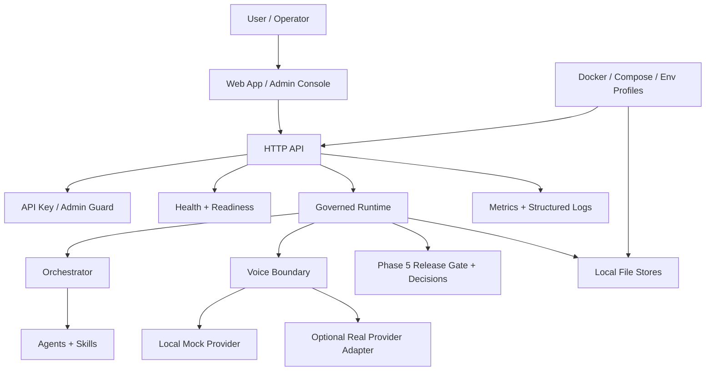
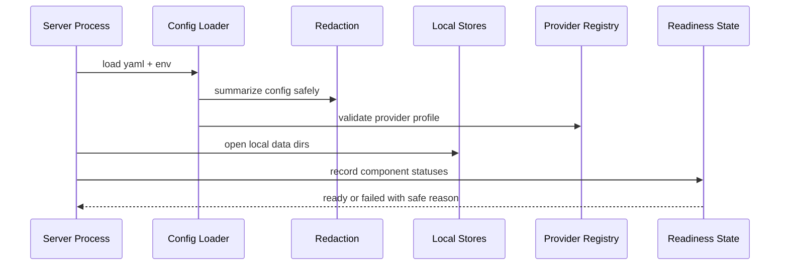
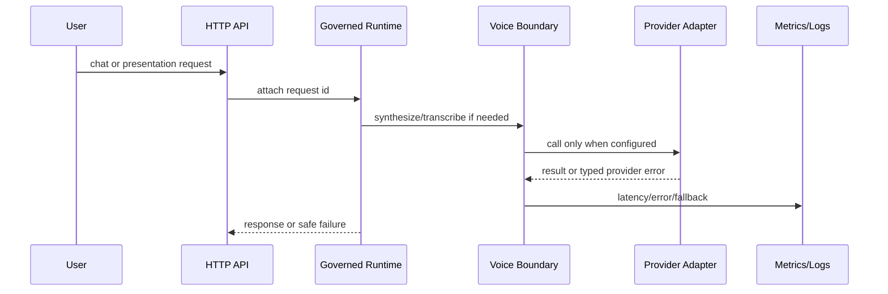

# Phase 6 Production Readiness, Provider Integration, and Deployment Design

Date: 2026-06-22

## Design Position

Phase 6 should make `digital-twin` production-shaped without making false production claims. The system already has a local digital-human runtime, admin loop, deterministic eval, release gate, and governance records. The missing layer is the operational membrane around that runtime: provider configuration, secrets, deployment packaging, readiness, observability, and runbooks.

The recommended design is **Phase 6A: Provider and Deployment Readiness MVP**.

## Principles

- Local/mock remains the default path.
- Real providers are adapters, not architectural centers.
- Tests must not call real networks or require credentials.
- Local file storage remains the persistence model.
- Deployment readiness must include config validation, readiness, observability, and rollback, not only a Dockerfile.
- Documentation must describe only shipped behavior.

## Proposed Architecture

## Core Components

### Provider Boundary

The provider boundary should reuse existing package seams instead of creating a provider framework too early.

Expected implementation areas for Stage 2 planning:

- `internal/voice`: provider-neutral TTS/ASR interfaces and existing mock behavior.
- `internal/config`: provider selection, endpoint, timeout, and key-reference configuration.
- `internal/presentation`: provider metadata surfaced in presentation events.
- `internal/core`: provider error wrapping and classification.

The first real adapter should be thin:

- Construct request from existing interface inputs.
- Send to configured base URL.
- Parse provider response into current result shape.
- Map provider status and malformed payloads to typed errors.
- Use `httptest.Server` in tests.

The adapter should be disabled unless explicitly configured.

### Configuration and Secrets

Configuration should move from "can load defaults" to "can explain whether this runtime can start safely."

Recommended additions:

- Environment profile field: `local`, `staging`, `production-like`.
- Provider config validation:
  - local/mock providers require no key.
  - real providers require base URL and key env var name.
  - startup error names the missing setting but not the secret value.
- Redaction helper used by logs, config summaries, readiness output, and error messages.
- `.env.example` documenting expected variables.

Do not commit real keys or provider-specific secrets.

### Deployment Package

The first deployment target should be local production-like Docker Compose.

Expected artifacts for Stage 2 planning:

- `deploy/Dockerfile`
- `deploy/docker-compose.yml`
- `deploy/README.md`
- `.env.example`
- optional `deploy/smoke.ps1` or Go-based smoke command if it fits existing patterns

The compose setup should:

- Build the Go server.
- Serve the Web/admin static assets through the existing server.
- Mount local data paths as volumes.
- Expose app port explicitly.
- Use local/mock providers by default.

No database service should be added in Phase 6A.

### Readiness and Health

Existing `/health` can remain a liveness signal. Phase 6 should add or harden readiness as the operational signal.

Readiness should check:

- Config profile is valid.
- Required local data directories are available.
- Provider configuration is internally consistent.
- Last release-gate status is present or explicitly skipped in local profile.
- Runtime bootstrap dependencies are registered.

Readiness should not leak secrets. It should return clear component statuses such as `ok`, `degraded`, `failed`, or `skipped`.

### Observability

Phase 6 should add practical, local-friendly observability:

- Request ID per HTTP request.
- Provider latency/error counters.
- Release-gate status in logs or metrics.
- Readiness failure reason codes.
- Provider fallback event if fallback is allowed.
- Secret-redaction tests for structured logging paths.

Cost metrics should remain estimates unless a provider response supplies actual usage data.

### Operator Runbooks

Add runbooks before claiming deployability:

- Start production-like local runtime.
- Configure provider credentials.
- Rotate provider secrets.
- Diagnose readiness failure.
- Handle provider outage.
- Roll back config/persona/release gate state.
- Back up and restore local file data.

Runbooks should include exact commands and expected outputs where stable.

## Data Flow

### Startup

### Request with Optional Provider

## Test Strategy for Stage 2

Stage 2 should turn this into a TDD matrix. Expected test groups:

| Area | Required tests |
| --- | --- |
| Provider adapter | fake-server request shape, auth header, timeout, non-2xx, malformed body, successful parse |
| Config validation | local profile defaults, real provider missing key, invalid profile, env override, no secret leak |
| Redaction | API key, bearer token, provider key, env-derived secret never appears in logs/readiness/errors |
| Readiness | healthy local runtime, missing data dir, invalid provider config, skipped release gate in local, failed gate in production-like |
| Deployment | Dockerfile syntax/build if Docker is available, compose config parse, documented fallback when Docker is unavailable |
| Smoke | health, ready, chat, stream, admin static route, governance decision persistence |
| Docs | README/release notes avoid claiming full production compliance |

## Risk Register

| Risk | Severity | Mitigation |
| --- | --- | --- |
| Provider work leaks credentials into logs | High | Central redaction helper plus tests across logs/readiness/errors |
| Real provider tests become flaky or costly | High | Fake-server-only tests; no credentials in CI |
| Phase 6 claims production readiness too broadly | High | Name it production-shaped/provider-deployment readiness; document exclusions |
| Docker adds environment drift | Medium | Keep compose simple and local/mock by default |
| Readiness becomes noisy | Medium | Use explicit component reason codes and stable statuses |
| Local file storage backup is unclear | Medium | Add backup/restore runbook and smoke test persistence |
| Auth scope balloons into identity platform | Medium | Harden API/admin guard only; defer OAuth/RBAC unless separately approved |

## Stage 2 Planning Recommendation

Use `$gstack-autoplan` to split Phase 6 into small TDD-friendly slices:

1. Provider/config spec tests.
2. Secret redaction helper and validation.
3. Optional first provider adapter behind fake-server tests.
4. Readiness endpoint/state model.
5. Docker/compose local production-like package.
6. Smoke checks and runbooks.
7. README/release notes updates with honest scope.

The first implementation slice should be configuration and redaction, not the real provider call. That gives every later provider/deployment change a safer boundary.

## Assignment

Approve or modify the Stage 1 scope before implementation planning:

- Recommended: approve Phase 6A as Provider and Deployment Readiness MVP.
- If you want a narrower first provider, choose TTS, ASR, LLM, or avatar/presentation.
- If you want a real deployment target beyond local Docker Compose, name it before Stage 2.

No production code should be written until the spec is approved and Stage 2 produces an approved plan and test matrix.
