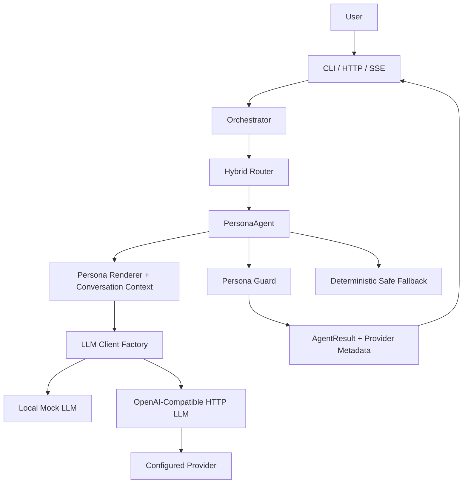
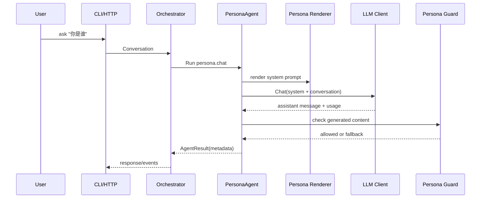
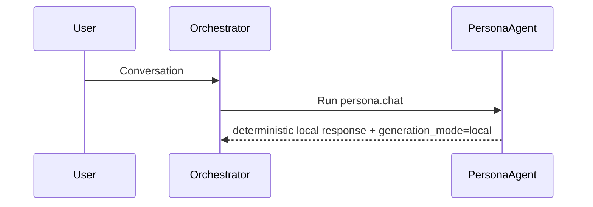

# Phase 7 LLM-Driven Persona Design

Date: 2026-06-23

Status: Approved design. Stage 3 implementation complete, Stage 4 review complete, Stage 5 local QA complete on 2026-06-24, and Stage 6 security check found no high-severity blockers. Pending Stage 7 ship/integration.

## Design Position

Phase 7 should make the digital human genuinely responsive without turning the whole system into an uncontrolled agent loop.

The recommended design is **Phase 7A: Real Persona Generation MVP**.

The first implementation should replace the hard-coded `PersonaAgent` response with an LLM-backed generation path only when an LLM is explicitly configured. Local/mock remains the default and must keep working with no secrets, no network, and deterministic tests.

## Current Behavior

Today, `PersonaAgent.Run` performs a persona safety skill check and returns this fixed response:

```text
I'm here and keeping the same professional persona.
```

This is useful for deterministic earlier phases, but it is now the main product illusion break. The system looks like a digital human, but general conversation is still a stub.

## Proposed Architecture



## Core Components

### LLM Configuration

Phase 7 should expand `internal/config.LLMConfig` from only `APIKey` to a production-shaped chat config:

- `provider`: `local`, `mock`, or `openai-compatible`.
- `base_url`: required when provider is `openai-compatible` in production-like mode.
- `api_key`: secret, redacted everywhere.
- `model`: required for configured real provider use.
- `timeout_ms` or timeout duration.
- optional fallback policy: `fallback_to_local` or `fail_closed`.

The existing secret-redaction pattern should include all LLM fields.

### LLM Client Factory

Add a small factory near `internal/llm` or `cmd/server` wiring:

- local/mock provider returns deterministic fake chat output.
- openai-compatible provider returns `llm.OpenAIClient`.
- unsupported provider returns an actionable config error.

The factory should not call the provider during construction.

### PersonaAgent Generation

`PersonaAgent` should accept optional generation dependencies:

- `llm.Client`
- model/provider metadata
- persona renderer or rendered system prompt provider
- fallback response policy

If no client is configured, behavior remains deterministic local mode. If a client exists:

1. Run existing pre-generation persona/safety check over the user input.
2. Render system prompt from active persona and runtime context.
3. Build a chat request from system prompt plus recent conversation messages.
4. Call `llm.Client.Chat`.
5. Validate non-empty assistant output.
6. Run persona guard over generated output.
7. Return generated answer with metadata:
   - `intent`
   - `llm_provider`
   - `llm_model`
   - `generation_mode`
   - usage counters if available

### Transparency Behavior

The question "你背后是什么模型" should not rely entirely on the model improvising. Phase 7 should include a transparency rule:

- In local/mock mode: answer that the current runtime is local deterministic mode and no real model is configured.
- In LLM mode: answer with configured provider/model metadata, without exposing endpoint secrets or API keys.

This can be implemented either as a small pre-generation branch in `PersonaAgent` or as strongly constrained system prompt instructions. Stage 2 should decide the simpler testable path.

### Fallback Behavior

Failures should be visible but safe:

- missing client: local deterministic response with metadata `generation_mode=local`.
- provider error: safe fallback with metadata `generation_mode=fallback` and redacted error category.
- timeout/cancel: return typed timeout/cancel behavior consistent with existing runtime patterns.
- guard rejection: return guard safe fallback and metadata `guard_reason`.

In production-like profiles, Stage 2 should decide whether provider failure returns fallback text or fails closed. The Phase 7A default recommendation is fallback in local/staging and fail closed only when explicitly configured.

### SSE and Presentation Compatibility

Phase 7A should preserve existing endpoints:

- `/chat` returns generated `AgentResult`.
- `/chat/stream` can continue to stream runtime events and completed message data.
- `/experience/stream` can continue to convert the final result into presentation events.

Token streaming is valuable, but it is not required for Phase 7A. It can be Phase 7B after non-streaming generation is stable.

## Data Flow

### Configured LLM Persona Chat



### Local Mode Persona Chat



## Test Strategy for Stage 2

Stage 2 should turn this into a TDD matrix. Expected test groups:

| Area | Required tests |
| --- | --- |
| Config | local default, openai-compatible missing model/base URL/API key in production-like, env overrides, secret redaction |
| LLM factory | local mock client, OpenAI-compatible client config, unsupported provider error, no network during construction |
| PersonaAgent | no client fallback, configured client uses rendered system prompt, conversation messages included, generated output returned |
| Guard | forbidden generated output replaced with safe fallback, low confidence uncertainty rule preserved |
| Provider failure | timeout, provider error, empty output, malformed provider response through fake client/server |
| Metadata | provider/model/generation mode included, secrets absent |
| Compatibility | CLI `ask`, `/chat`, `/chat/stream`, `/experience/stream` still pass existing tests |
| Docs | README explains local mode vs LLM mode and CI no-real-provider policy |

## Risk Register

| Risk | Severity | Mitigation |
| --- | --- | --- |
| Tests call a paid provider | High | Fake client and `httptest.Server` only |
| Secret leaks in logs/metadata/readiness | High | Reuse redaction and test response metadata |
| LLM output violates persona boundaries | High | Post-generation guard and safe fallback |
| Model identity is misleading | Medium | Explicit transparency rule and metadata |
| Provider latency makes local UX confusing | Medium | Timeout config and clear fallback metadata |
| Scope expands into full agentic planning | High | Keep Phase 7A to persona.chat only |
| Existing deterministic smoke breaks | High | local/mock remains default |

## Stage 2 Planning Recommendation

Use `$gstack-autoplan` to split Phase 7 into small TDD-friendly slices:

1. Config and redaction for LLM provider fields.
2. LLM client factory with local/mock default.
3. PersonaAgent generation dependency injection.
4. Prompt construction with persona renderer and conversation context.
5. Post-generation persona guard and fallback.
6. Server/bootstrap wiring.
7. CLI/HTTP/SSE compatibility tests.
8. Docs and release notes.

Do not start with token streaming. Start with one reliable non-streaming generated answer through `/chat`; streaming can follow after correctness and safety are proven.

## Assignment

Approve or revise the Phase 7A scope:

- Recommended: approve **LLM-Driven PersonaAgent only** as Phase 7A.
- Defer LLM router, RAG answer generation, agentic tool planning, and token streaming unless Stage 2 explicitly includes a narrow follow-up slice.

The spec and Stage 2 plan were approved before production code was written.
