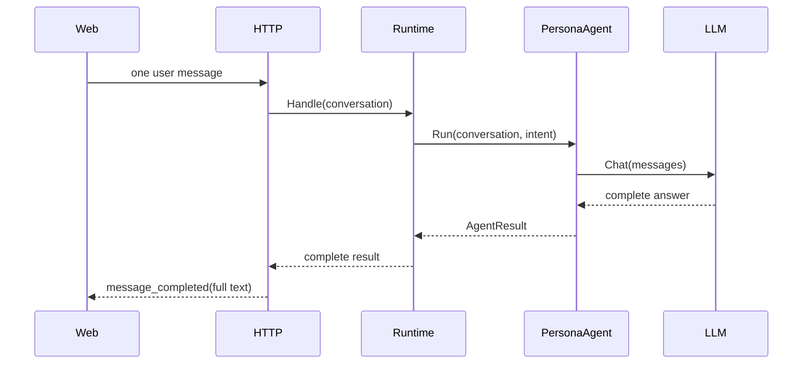
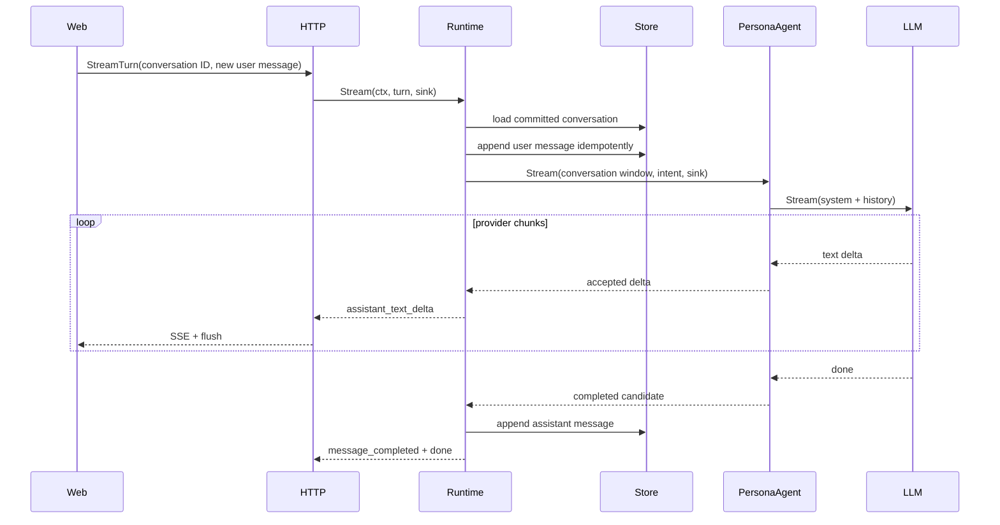

# Phase 8 Real Conversation Loop Design

Date: 2026-06-25

Status: Approved design for Stage 2 planning

Source: `docs/specs/phase-8-real-conversation-loop.md`

## Design Position

Phase 8 introduces a runtime-owned streaming conversation transaction.

The runtime, rather than the HTTP handler or `PersonaAgent`, owns the lifecycle:

1. validate one new user turn;
2. load committed history;
3. serialize access to the conversation;
4. build a bounded model window;
5. route and select an Agent;
6. stream accepted deltas;
7. handle cancellation or failure;
8. commit the final assistant message only after successful completion.

This preserves the existing architecture while creating a reusable boundary for later
RAG, tool, and voice streaming.

## Current and Target Flow

### Current



### Target



## Proposed Boundaries

### Turn Input

Introduce a narrow turn request rather than trusting a client-supplied transcript:

```go
type TurnRequest struct {
    ConversationID string
    TenantID       string
    UserID         string
    TurnID         string
    AttemptID      string
    Message        types.Message
    Metadata       types.Metadata
}
```

Validation requires:

- non-empty scoped IDs;
- non-empty logical turn and attempt IDs;
- exactly one `user` message;
- non-empty message ID and content;
- no client-supplied `system`, `assistant`, or `tool` message in a turn request.

The existing full `types.Conversation` contract remains available for internal use
and backward-compatible `/chat` requests during migration.

### Runtime Streaming Contract

Prefer additive optional interfaces so existing deterministic Agents and test fakes
do not all change at once:

```go
type StreamSink interface {
    Emit(context.Context, StreamEvent) error
}

type StreamingOrchestrator interface {
    Stream(context.Context, TurnRequest, StreamSink) (types.AgentResult, error)
}

type StreamingAgent interface {
    Agent
    Stream(context.Context, types.Conversation, types.Intent, StreamSink) (types.AgentResult, error)
}
```

The runtime checks whether the selected Agent implements `StreamingAgent`:

- streaming Agent: forward real deltas;
- legacy Agent: call `Run`, emit one completed result, and preserve compatibility.

The exact package placement and names are Stage 2 decisions. The behavioral boundary
is fixed by this design.

### Conversation Service

Add a small conversation coordinator around `store.Store` and
`memory.ShortTermMemory`. It is not a separate network service.

Responsibilities:

- load or create conversation;
- distinguish explicit not-found from permission, corruption, and decode failures;
- validate tenant/user ownership;
- append the user message idempotently;
- build a bounded runtime window;
- append a completed assistant message;
- serialize concurrent turns for the same scoped conversation;
- expose deterministic errors for duplicate, conflict, and missing history.

The coordinator must not call the LLM or emit HTTP events.

### Persistence Model

Local files remain the source of truth for committed history.

Recommended single-process transaction behavior:

1. acquire keyed conversation lock;
2. load existing conversation;
3. create only on an explicit conversation-not-found result;
4. reject a different tenant/user namespace;
5. validate logical turn ID, attempt ID, and user-content idempotency;
6. append the user message only when the logical turn is new;
7. save the conversation and mark the attempt generating;
8. generate and stream the assistant candidate;
9. append the assistant message only on successful completion and guard approval;
10. save final turn state and release the lock.

Holding a lock during provider generation limits one active turn per conversation,
which is acceptable for the local-first Phase 8 profile. Stage 2 may shorten the lock
with optimistic versions only if it can prove equivalent ordering and simpler tests.

Each generated message should include request/attempt metadata so retries and audit
records remain explainable.

The coordinator performs the full read-modify-write under its scoped lock and must not
treat the current `Store.AppendMessage` as transactional. Phase 8 assumes one server
process and one shared LocalStore instance. Cross-process writers and power-loss
durability are out of scope. File replacement must remain corruption-safe for
ordinary process failures, but this design does not claim database-grade crash
durability.

The Store contract must add an explicit conversation-not-found outcome. Permission,
read, and JSON-decoding failures remain store failures and must never be treated as a
new conversation.

### Turn State and Retry

```text
new -> user_committed -> generating -> completed
                                  -> failed
                                  -> canceled
```

- `turn_id` identifies one logical user/assistant pair.
- `attempt_id` identifies one generation attempt for that turn.
- A failed or canceled turn may be retried with a new `attempt_id`.
- Retrying does not append the user message again.
- A completed turn cannot create a second assistant message.
- Same `turn_id` with different user content and reused `attempt_id` are conflicts.
- Attempt state may live in conversation metadata or an adjacent local record; Stage
  2 must select one format and its cleanup policy.

### PersonaAgent Streaming

The streaming path reuses current Phase 7 behavior:

- `persona_check` before generation;
- model-identity transparency response;
- trusted persona system prompt;
- removal of untrusted client system messages;
- provider/model metadata;
- fallback policy;
- persona guard.

The new path calls `llm.Client.Stream` and accumulates accepted chunks in order.

`PersonaAgent.Run` may remain non-streaming for `/chat`, or Stage 2 may implement it by
collecting the new streaming path into a final result. The preferred direction is one
generation implementation with two consumers to avoid behavior drift.

## Incremental Safety Design

Final-only guard evaluation is incompatible with immediate streaming because emitted
text cannot be recalled.

Phase 8 policy:

1. classify the request with existing deterministic safety/persona checks;
2. for normal-confidence, deterministic-low-risk persona chat, hold a rolling buffer
   ending at sentence or bounded character boundaries;
3. run deterministic forbidden-claim and boundary checks before releasing each
   buffered segment;
4. retain a short suffix to avoid splitting a forbidden phrase across chunks;
5. run the full persona guard on the final accumulated answer;
6. for low-confidence, high-risk, or requests subject to any whole-answer rule, buffer
   the complete response until guard approval and then emit it in bounded deltas.

This policy emits safety-accepted segments rather than raw provider chunks. It
preserves visible streaming for ordinary chat while ensuring the existing guard is
meaningful. Stage 2 must define confidence/risk thresholds, buffer limits, and
cross-chunk forbidden-phrase tests.

## Event Model

The runtime stream event should be transport-neutral:

```go
type StreamEvent struct {
    Name           StreamEventName
    RequestID      string
    ConversationID string
    Sequence       uint64
    OccurredAt     time.Time
    Payload        types.Metadata
    Metadata       types.Metadata
}
```

Expected event order for success:

1. `request_started`
2. `route_selected`
3. `agent_selected`
4. zero or more `assistant_text_delta`
5. `message_completed`
6. `done`

Expected event order for cancellation:

1. normal prefix events;
2. zero or more accepted deltas;
3. internally record `canceled`;
4. emit `canceled` and optional `done` only when the transport remains writable.

Expected event order for provider failure after output:

1. normal prefix events;
2. one or more accepted deltas;
3. `error`;
4. `done` with failed status.

`message_completed` payload contains the complete accepted assistant message and
metadata. It is emitted only after persistence succeeds.

## SSE Transport

`/chat/stream` becomes a thin adapter:

- decode and validate a turn request;
- set SSE headers before generation starts;
- implement `StreamSink` by encoding each runtime event;
- call `http.Flusher.Flush()` after every event;
- return sink errors when the client disconnects;
- rely on request context cancellation to stop runtime and provider work.

Once SSE headers are written, failures must be represented as SSE events rather than
changing the HTTP status code.

A disconnected client cannot reliably receive a canceled event. The server records
the outcome internally and attempts the event only while the sink remains writable.

The handler must continue escaping multiline data and must never put untrusted content
in the SSE `event:` field.

## Experience Stream

The presentation layer should consume runtime deltas:

- forward accepted text deltas immediately;
- keep avatar state at `thinking` until the first accepted delta;
- switch to `speaking` when text begins;
- generate final subtitle/TTS artifacts only after `message_completed` in Phase 8;
- emit `idle`, `canceled`, or `error` terminal avatar state as appropriate.

Real streaming TTS is deferred. Text remains the source of truth.

## Web Behavior

The Web client keeps one active assistant transcript element:

- create it when the request starts;
- append each text delta to the same node;
- expose a stop button backed by `AbortController`;
- disable duplicate submit while a turn is active for the same conversation;
- retain the same conversation ID across turns;
- show fallback, canceled, and error outcomes distinctly;
- render canceled locally when the fetch rejects with `AbortError`;
- do not display a successful `done` marker after failure.

The client does not resend prior trusted history.

## Failure Matrix

| Failure point | Before first delta | After first delta | Persist assistant |
| --- | --- | --- | --- |
| Provider timeout | persisted safe fallback or fail closed | error terminal | Only accepted fallback |
| Provider non-2xx | persisted safe fallback or fail closed | not applicable | Only accepted fallback |
| Malformed chunk | persisted safe fallback or fail closed | error terminal | Only accepted fallback |
| Empty completed stream | persisted safe fallback or fail closed | not applicable | Only accepted fallback |
| EOF without explicit done | persisted safe fallback or fail closed | error terminal | Only accepted fallback |
| Client cancellation | canceled | canceled | No |
| Sink/write failure | cancel provider | cancel provider | No |
| Incremental guard rejection | safe fallback or fail closed | stop before rejected segment, error terminal | No partial candidate |
| Final guard rejection | safe fallback if nothing exposed | error terminal if content was exposed | No |
| Store commit failure | error terminal | error terminal after generated text | No completed event |

If persistence fails after deltas were shown, the server must emit an explicit
`persistence_failed` outcome and must not claim completion.

A safe pre-delta fallback is a normal accepted assistant response. The coordinator
persists it before `message_completed`, so later turns see the answer the user saw.

## Concurrency and Idempotency

- Scope locks by tenant, user, and conversation ID.
- Only one active generation is allowed per scoped conversation.
- A second active turn receives a typed conflict before SSE streaming begins.
- Reusing a logical turn ID with identical content after failure/cancellation permits
  a new attempt ID without duplicating the user message.
- Reusing a completed logical turn ID follows the deterministic Stage 2-selected
  replay/conflict behavior without creating another assistant message.
- Reusing a user message ID with different content is rejected.
- Assistant message IDs derive from request IDs or another collision-resistant source.
- Concurrent turns in different conversations remain independent.
- Lock bookkeeping must delete unused entries to avoid unbounded growth.

## Observability

Record:

- time to first accepted delta;
- total generation latency;
- accepted chunk count;
- completion, cancellation, fallback, and failure counters;
- provider and model labels from safe configuration metadata;
- persistence latency and failure count;
- request ID and conversation ID.

Never record:

- API keys;
- authorization headers;
- raw provider response bodies;
- complete private prompts in ordinary logs.

## Test Strategy for Stage 2

### Unit

- stream event ordering and terminal uniqueness;
- PersonaAgent ordered chunk accumulation;
- pre-first-delta fallback;
- post-first-delta error without fallback;
- cancellation propagation;
- incremental guard across chunk boundaries;
- conversation idempotency and scope isolation;
- logical turn/attempt state transitions and retry after failure/cancellation;
- same-conversation conflict and different-conversation concurrency;
- bounded short-term window.

### Component

- fake OpenAI-compatible SSE provider with delayed chunks;
- malformed SSE, empty stream, non-2xx, timeout, and disconnect;
- truncated EOF without `[DONE]`;
- LocalStore persistence across reopen;
- runtime success commits exactly one user and one assistant message;
- canceled runtime commits no assistant message.

### HTTP

- first delta arrives before provider completion;
- every event flushes;
- client cancellation closes provider request;
- SSE event data remains injection-safe;
- errors after headers are emitted as SSE;
- `/chat` remains compatible.

### Web

- deltas append to one assistant line;
- stop button aborts active fetch;
- canceled and failed states do not render success;
- conversation ID remains stable across 10 turns.

### End-to-End

- deterministic 10-turn fake-provider conversation;
- restart using the same data directory and continue the conversation;
- optional DeepSeek manual smoke outside CI;
- race test with concurrent conversations and same-conversation conflict.
- short-term window tests that always retain the current user message and a contiguous
  suffix of complete turns, including CJK and an oversized latest message.

## `/chat` Compatibility

Phase 8 leaves `POST /chat` unchanged:

- request body remains a full `types.Conversation`;
- response remains `types.AgentResult`;
- processing remains stateless for that request;
- it does not load or mutate server-owned conversation history;
- existing HTTP status and error shapes remain unchanged.

The new `TurnRequest` and durable history contract apply to `/chat/stream` and the
streaming experience path only.

## Stage 2 Decisions to Lock

1. Exact interfaces and package ownership for turn requests, sinks, and stream events.
2. Conversation coordinator API and local file transaction strategy.
3. Incremental guard buffer size and risk classification rules.
4. Internal migration mechanics while preserving the locked `/chat` compatibility
   contract.
5. Whether `/experience/stream` directly implements a runtime sink or consumes a
   reusable streaming presentation adapter.
6. Metrics names and audit-record representation for partial failures.

## Risks

| Risk | Severity | Mitigation |
| --- | --- | --- |
| Unsafe text is emitted before guard rejection | High | Incremental buffering and cross-chunk guard tests |
| Partial answer is persisted as complete | High | Commit only after provider done, final guard, and store success |
| Two turns interleave history | High | Scoped keyed lock and conflict tests |
| Client disconnect leaves provider request running | High | Context propagation and blocking fake-provider cancellation test |
| Fallback text is appended to partial LLM text | High | First-delta state machine and terminal-event invariants |
| LocalStore writes are corrupted | High | Single shared instance, scoped read-modify-write lock, explicit not-found, corruption tests |
| Web creates one line per chunk | Medium | Single active assistant node and browser/static tests |
| Phase expands into full agent orchestration | High | Persona streaming only; legacy Agents use completed compatibility path |

## Success Definition

Phase 8 is successful when a user can start the server with DeepSeek configuration,
hold a coherent 10-turn text conversation, watch text arrive incrementally, stop a
response, retry safely, restart the server without losing completed turns, and
understand whether a request completed, fell back, was canceled, or failed.

No part of this definition requires a database, autonomous tool planning, or a paid
provider call in CI.

## Gate

Do not begin Stage 2 planning until the user explicitly approves
`docs/specs/phase-8-real-conversation-loop.md`.
