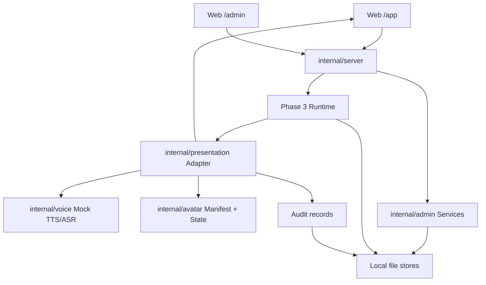

# Phase 4 Digital Human Experience and Admin Plan

## Sources

- `plan.md`: Phase 4, M8, and M9.
- `docs/specs/phase-4-digital-human-experience-admin.md`.
- `docs/design/phase-4-digital-human-experience-admin.md`.
- Phase 3 runtime/API polish is already merged into `main` at `dad6fad`, so Phase 4 can build on `/chat`, `/chat/stream`, and recorded runtime events.

## Plan Summary

Phase 4 will ship a protocol-first product slice: a deterministic presentation event layer, mock/local voice and avatar foundations, a first usable Web digital-human console, and a minimal local-first admin console. The goal is not a flashy provider demo; the goal is a professional digital-human loop that users can operate and developers can test.

The approved build shape is:

- Go-served static Web UI for the first Phase 4 implementation.
- One Web app with user and admin routes.
- Local file storage and in-memory fakes; no SQLite.
- Mock TTS, ASR, subtitle, audio, avatar, and interruption paths first.
- Real providers, rich 3D/Live2D, production auth, and database migrations stay out of scope.

## Review Scores

| Review | Score | Result |
| --- | ---: | --- |
| CEO / Product | 8/10 | Approve protocol-first product slice; reject provider-first or UI-only build |
| Design | 8/10 | Approve actual app surface, not landing page; admin should be dense and operational |
| Engineering | 8/10 | Approve with strict package boundaries and TDD sequence |
| DX | 7/10 | Approve if docs, local run commands, deterministic fixtures, and actionable errors are part of the phase |

## CEO Review

The strongest product move is to make Phase 4 prove the digital-human operating loop, not just the visual illusion. A professional digital human needs both the user-facing experience and the operator-facing correction/configuration workflow; shipping one without the other creates a demo, not a product.

The product risk is scope spread. M8 and M9 touch voice, avatar, Web, admin, audit, permissions, persona, memory, and knowledge. The plan therefore uses a narrow vertical slice: presentation protocol first, then user UI over that protocol, then admin modules over local versioned stores.

## Design Review

The first screen must be the working digital-human console. It should show the conversation, avatar state, subtitles, tool/citation status, and input controls without marketing copy. The admin area should feel like a compact SaaS operations surface: tables, forms, validation states, publish/rollback actions, and audit detail.

Visual implementation should stay conservative for Phase 4. A manifest-driven avatar panel with clear state changes is better than an under-tested custom 3D surface. Browser QA must cover desktop and mobile widths so controls, subtitles, and admin forms do not overlap.

## Engineering Review

The presentation model must be transport-neutral and independent from HTTP handlers. `internal/server` should adapt routes to domain services, not own voice, avatar, persona publish, or audit rules. Web assets should consume the same event names used in tests.

The most important engineering decision is a first-class `PresentationEvent`. Phase 3 runtime events explain backend work; Phase 4 presentation events explain what the user sees and hears. This keeps future TTS/ASR/avatar providers swappable.

## DX Review

A new developer should be able to run the server, open the Web app, send a message, and inspect local admin data in under five minutes. Error messages should include problem, cause, and fix. Fixtures should be committed for avatar manifests, mock transcripts, knowledge uploads, and SSE streams.

## Decision Audit Trail

| # | Phase | Decision | Classification | Principle | Rationale | Rejected |
| --- | --- | --- | --- | --- | --- | --- |
| 1 | CEO | Build protocol-first product slice | Auto-decided | Completeness | Covers user experience and operator loop without provider lock-in | Visual-first, admin-first, provider-first |
| 2 | Design | First screen is the usable digital-human console | Auto-decided | User value | The repo needs a product surface, not a landing page | Marketing hero page |
| 3 | Eng | Add `PresentationEvent` as Phase 4 boundary | Auto-decided | Interface first | Gives Web, voice, avatar, and tests one stable contract | Reusing raw runtime events directly in UI |
| 4 | Eng | Keep Web UI Go-served static for Phase 4 | Taste decision | Simplicity | Current repo has no frontend toolchain; static assets reduce setup cost | Dedicated frontend build pipeline now |
| 5 | Eng | Add `/experience/stream` while preserving `/chat/stream` | Auto-decided | Backward compatibility | Keeps Phase 3 API stable while giving Phase 4 product semantics | Mutating `/chat/stream` into UI-only protocol |
| 6 | Eng | Use local file stores and fakes, no SQLite | User constraint | Respect explicit constraint | User said not to use SQLite now; local stores are enough for deterministic tests | SQLite schema and migrations |
| 7 | Product | Mock voice uses scripted/upload-style input first | Auto-decided | Testability | Avoids browser permission and hardware variance before the protocol stabilizes | Real microphone capture as first path |
| 8 | Product | Persona publish affects new conversations by default | Auto-decided | Operational safety | Avoids mid-conversation identity changes; active opt-in can come later | Forced mutation of active sessions |
| 9 | Security | Tool policy is enforced before skill execution | Auto-decided | Least privilege | Admin UI is not enough; server-side enforcement must exist | UI-only allowlist |

## Architecture

## Data Flow

1. User sends text or mock audio from `/app`.
2. Server accepts the request through the Phase 4 experience handler.
3. Runtime handles the conversation through the existing orchestrator.
4. Presentation adapter converts runtime result/events into ordered `PresentationEvent` records.
5. Mock TTS, subtitle timeline, and avatar state machine enrich the stream.
6. Web UI renders text, subtitle, audio placeholder, citation/tool status, avatar state, error, and done events.
7. Audit service records conversation metadata and presentation event summary.

Admin flow:

1. Operator opens `/admin`.
2. Persona, memory, knowledge, tool policy, and audit screens call thin HTTP handlers.
3. `internal/admin` validates and writes versioned local records.
4. New conversations read active persona/tool/knowledge configuration from local stores.

## Package Plan

| Package / Path | Responsibility |
| --- | --- |
| `internal/presentation` | `PresentationEvent`, ordering, subtitles, speech timeline, runtime adapter, interruption policy |
| `internal/voice` | `TTSClient`, `ASRClient`, deterministic mock implementations |
| `internal/avatar` | Avatar manifest schema, validation, asset fixtures, state machine |
| `internal/admin` | Persona versions, memory controls, knowledge upload/chunk preview, tool policies, audit queries |
| `internal/server` | HTTP/SSE handlers, static asset serving, request/response adapters |
| `web/` | Static HTML/CSS/JS for `/app` and `/admin` |
| `assets/avatar/` | Sample manifest and placeholder asset metadata |
| `docs/` | Phase 4 usage notes and release notes updates |

## Implementation Tasks

### Foundation

- [x] P4-01: Add `internal/presentation` event model.
  - Tests first: sequence ordering, required metadata, JSON encoding, error payloads.
  - Output: transport-neutral `PresentationEvent` and helpers.
- [x] P4-02: Add speech timeline and subtitle model.
  - Tests first: text segmentation, timestamp estimates, simplified viseme markers, empty text behavior.
  - Output: deterministic `SpeechTimeline`.
- [x] P4-03: Add avatar manifest schema and fixture.
  - Tests first: required fields, supported states, fallback state, version, license metadata.
  - Output: sample manifest under local assets or fixtures.
- [x] P4-04: Add avatar state machine.
  - Tests first: idle/listening/thinking/speaking/error/interrupted transitions and invalid transition handling.
  - Output: deterministic state mapper.
- [x] P4-05: Add `internal/voice` mock TTS/ASR contracts.
  - Tests first: stable TTS chunks, stable ASR transcript segments, timestamps, provider metadata.
  - Output: provider-neutral interfaces and local mocks.

### Runtime and Streaming

- [x] P4-06: Add runtime-to-presentation adapter.
  - Tests first: Phase 3 `AgentResult` and runtime events produce text, subtitle, audio, avatar, tool status, and done events.
  - Output: adapter used by HTTP layer.
- [x] P4-07: Add `/experience/stream` SSE endpoint.
  - Tests first: ordered SSE events, sequence IDs, cancellation, final done, compatibility with existing `/chat/stream`.
  - Output: product-level event stream for Web UI.
- [x] P4-08: Add interruption controller.
  - Tests first: active mock stream cancels, emits `interrupted`, records interrupted metadata, starts a new request.
  - Output: testable half-duplex interruption path.

### User Web Experience

- [x] P4-09: Serve static Web shell.
  - Tests first: server route returns app/admin static entry points and correct content type.
  - Output: `/app` and `/admin` shell.
- [x] P4-10: Implement text chat stream renderer.
  - Tests first where practical: handler/static assets plus browser QA for send/stream/done.
  - Output: text input, assistant stream, error/retry, citation/tool status.
- [x] P4-11: Implement avatar/subtitle/audio-placeholder panel.
  - Tests first: event renderer handles avatar/subtitle/audio/error states.
  - Output: visible state changes and subtitles.
- [x] P4-12: Implement mock voice flow.
  - Tests first: scripted transcript/mock upload becomes ASR events and assistant presentation response.
  - Output: voice-like interaction without microphone dependency.

### Admin Console

- [x] P4-13: Add persona admin service.
  - Tests first: draft, validate, publish, rollback, new-session active version.
  - Output: local persona version records and HTTP handlers.
- [x] P4-14: Add persona admin UI.
  - Tests first: handler/static routes and browser QA publish/rollback.
  - Output: editor with validation errors and publish state.
- [x] P4-15: Add memory admin service and UI.
  - Tests first: list, inspect, delete/disable, recall exclusion.
  - Output: local memory controls.
- [x] P4-16: Add knowledge upload service and UI.
  - Tests first: upload, parse, chunk preview, failed parse leaves active version intact, citation test.
  - Output: local knowledge management loop.
- [x] P4-17: Add tool policy service, enforcement, and UI.
  - Tests first: unauthorized tool blocked before execution, authorized tool allowed, policy persisted locally.
  - Output: tenant/persona allowlist and approval policy.
- [x] P4-18: Add audit records and dashboard.
  - Tests first: conversation status, latency, selected agent, tool/safety errors, presentation summary.
  - Output: inspectable conversation audit.

### Docs and Release

- [x] P4-19: Update README and release notes.
  - Tests first: `rg` checks for real feature names and no false provider claims.
  - Output: docs reflect actual Phase 4 implementation only.

## Recommended Execution Order

1. P4-01.
2. P4-02, P4-03, and P4-05 in parallel.
3. P4-04 after P4-03.
4. P4-06 after P4-01/P4-02/P4-04/P4-05.
5. P4-07 and P4-08.
6. P4-09 through P4-12.
7. P4-13 through P4-18, with independent admin modules parallelized after local store conventions are in place.
8. P4-19.

## Parallel Workstreams

| Workstream | Tasks | Can start after |
| --- | --- | --- |
| Presentation core | P4-01, P4-02, P4-06, P4-07, P4-08 | Spec and plan approval |
| Avatar | P4-03, P4-04, P4-11 | P4-01 for event naming |
| Voice | P4-05, P4-12 | P4-01 for event naming |
| Web user | P4-09, P4-10, P4-11, P4-12 | P4-07 |
| Admin persona/memory | P4-13, P4-14, P4-15 | Local store convention |
| Admin knowledge/tools/audit | P4-16, P4-17, P4-18 | Local store convention and runtime integration |
| Docs | P4-19 | Actual shipped behavior known |

## Blocking Dependencies

- P4-06 requires P4-01 plus at least one subtitle/avatar/voice path.
- P4-10 requires P4-07.
- P4-12 requires P4-05 and P4-07.
- P4-14 requires P4-13.
- P4-17 requires a clear server-side hook before skill execution.
- P4-18 requires runtime and presentation events to expose audit metadata.

## Test Matrix

| Level | Test | Command / Evidence |
| --- | --- | --- |
| Unit | Presentation event metadata, ordering, JSON encoding | `go test ./internal/presentation` |
| Unit | Speech timeline subtitles and visemes | `go test ./internal/presentation` |
| Unit | Avatar manifest validation and state machine | `go test ./internal/avatar` |
| Unit | Mock TTS/ASR determinism | `go test ./internal/voice` |
| Unit | Admin services: persona, memory, knowledge, tool policy, audit | `go test ./internal/admin` |
| Integration | Runtime result to presentation event stream | `go test ./internal/presentation ./internal/server` |
| HTTP/SSE | `/experience/stream` ordering, cancellation, done, errors | `go test ./internal/server` |
| Compatibility | Existing CLI, `/chat`, `/chat/stream` behavior | `go test ./cmd/... ./internal/server` |
| Browser QA | `/app` text chat, subtitles, avatar state, retry | gstack/browse or Playwright screenshot + interaction evidence |
| Browser QA | `/app` mock voice flow | gstack/browse or Playwright interaction evidence |
| Browser QA | `/admin` persona publish/rollback | gstack/browse or Playwright interaction evidence |
| Browser QA | `/admin` memory/knowledge/tool/audit flows | gstack/browse or Playwright interaction evidence |
| Full repo | Regression suite | `go test ./...` |
| Static check | Vet | `go vet ./...` |
| Build | Server binary | `go build ./cmd/server` |
| CI-only | Race where supported | `go test -race ./...` on Linux/amd64 CI, not Windows/386 |

## RED/GREEN/REFACTOR Rules for Stage 3

Every implementation task must start with a failing test. The failing test must name the behavior from this plan, not an implementation detail. Production code can be added only after the red test fails for the expected reason.

For browser-facing work, use the closest practical red test first:

- Handler tests for static route and API behavior.
- JavaScript unit tests only if a test harness already exists or is introduced as part of the approved slice.
- Browser QA evidence after the server is running.

## Failure Modes Registry

| Failure | Required behavior | Test evidence |
| --- | --- | --- |
| TTS mock fails | Emit `error`; text/subtitle remain visible; stream can finish safely | Unit + HTTP test |
| ASR mock fails | Show transcript error and allow text fallback | Unit + browser QA |
| Invalid avatar manifest | Reject invalid manifest or fall back to `idle` with warning | Unit test |
| SSE disconnect | Cancel presentation work and mark audit cancelled/interrupted | HTTP cancellation test |
| Persona draft invalid | Block publish and preserve last active version | Admin unit + browser QA |
| Knowledge parse fails | Mark upload failed; keep active knowledge unchanged | Admin unit + browser QA |
| Memory delete/disable | Deleted/disabled record excluded from future recall | Admin unit/integration test |
| Tool policy denies call | Reject before skill execution and audit denial | Unit/integration test |
| Interruption race | Emit one `interrupted`; old stream stops; new request proceeds | Unit + HTTP test |
| Malformed presentation event | UI shows recoverable error; server logs validation problem | Browser QA + handler test |

## DX Implementation Checklist

- [ ] README includes exact local run command for server and Web UI URL.
- [ ] README includes a copy-paste `/experience/stream` example.
- [ ] Local data directories are documented and safe to clean.
- [ ] Mock voice/avatar fixtures are committed and named clearly.
- [ ] Error messages include problem, cause, and fix.
- [ ] Admin publish/delete/upload actions show success and failure states.
- [ ] Release notes describe only implemented Phase 4 behavior.

## Not in Scope

- Real TTS provider integration.
- Real ASR provider integration.
- Real microphone capture as required functionality.
- Rich 3D, Live2D, video avatar generation, or animation rigging.
- SQLite, Postgres, Redis, object storage, or external vector DB.
- Production authentication, billing, SOC/compliance workflow, or deployment automation.
- Full Phase 5 evaluation, cost governance, or security operations dashboards.

## Completion Criteria

Phase 4 is complete when:

1. The user can open `/app`, send text, receive streamed presentation events, see subtitle/avatar state changes, and recover from an error.
2. The user can run a mock voice flow without microphone hardware.
3. An operator can open `/admin` and complete persona publish/rollback, memory delete/disable, knowledge upload/preview, tool policy edit, and audit inspection.
4. Existing Phase 3 CLI, `/chat`, and `/chat/stream` behavior remain compatible.
5. `go test ./...`, `go vet ./...`, and `go build ./cmd/server` pass.
6. Browser QA evidence exists for `/app` and `/admin`.
7. README and release notes match the actual implementation.

## Approval Gate

Stage 2 is complete when this plan is approved. Do not write Phase 4 implementation code until the user replies:

`I approve the plan`
