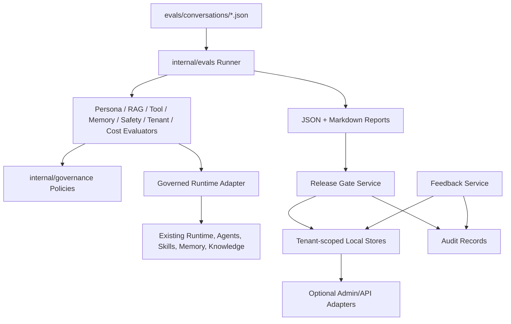

# Phase 5 Governance, Evaluation, Security, and Operations Plan

## Sources

- `plan.md`: Phase 5 and M10.
- `AGENTS.md`: SDD + TDD sprint workflow.
- `docs/specs/phase-5-governance-evaluation-operations.md`.
- `docs/design/phase-5-governance-evaluation-operations.md`.
- Phase 4 implementation on `main`: digital-human Web app, admin console, local persona/memory/knowledge/tool/audit stores, presentation events, and `/experience/stream`.

## Plan Summary

Phase 5 will ship a local-first governance loop for the professional digital human. The first slice is **Phase 5A: Launch Gate MVP**: deterministic eval fixtures, runtime governance wiring, policy evaluators, release gate records, rollback records, feedback records, and audit-visible decisions.

The approved build shape is:

- Keep local file storage and in-memory fakes; do not introduce SQLite or external services.
- Build executable gates before dashboards.
- Use deterministic evaluators as the CI baseline; leave LLM-as-judge optional and out of scope for this slice.
- Prove that governed runtime paths use operator-controlled persona/tool/knowledge/memory policy versions.
- Preserve Phase 3 and Phase 4 HTTP/API behavior.
- Implement every production behavior through RED -> GREEN -> REFACTOR using the Stage 2 test matrix.

## Review Scores

| Review | Score | Result |
| --- | ---: | --- |
| CEO / Product | 9/10 | Approve Launch Gate MVP; reject dashboard-first governance |
| Design | 8/10 | Approve evidence-first operations; admin UI can consume results after contracts stabilize |
| Engineering | 8/10 | Approve with strict package boundaries, local atomic stores, and runtime pre-execution policy hooks |
| DX | 8/10 | Approve if eval commands, fixture errors, reports, and release decisions are copy-pasteable and testable |

## CEO Review

The highest-value Phase 5 product is not another admin page. It is the ability to answer one operating question with evidence:

> Can this persona, knowledge, tool policy, prompt/model setting, or memory policy be safely published right now?

The product risk is false confidence. A professional digital human can look polished while still leaking memory, obeying malicious knowledge text, calling unauthorized tools, or publishing unsafe persona changes. Phase 5 therefore turns safety from a claim into an executable gate with pass/fail output, failure evidence, and rollback records.

## Design Review

Phase 5 design is operational rather than decorative. The primary user experience is the governance loop: run evals, inspect failures, block or approve release candidates, roll back when needed, and convert feedback into future eval evidence.

The first implementation should not spend effort on a broad dashboard. A CLI/test/report surface is acceptable if it produces clear Markdown and JSON evidence. Future admin screens should be adapters over the same records, not separate logic.

## Engineering Review

The most important engineering dependency is runtime governance wiring. Evals are only meaningful if they exercise the same active persona, tool policy, knowledge corpus, memory policy, and model/cost metadata that operators publish.

The second critical dependency is tool pre-execution enforcement. Phase 4 has admin authorization checks, but Phase 5 must prove denied tools do not invoke the underlying `Skill.Run` path. This should be tested with a counting or sentinel skill.

Local stores should follow the existing safe-write pattern where practical: tenant-scoped keys, temp-write plus rename, and deterministic in-memory alternatives for unit tests.

## DX Review

A developer should be able to add an eval fixture, run the suite, understand exactly why it failed, and know which release candidate was blocked. Fixture errors must include file path, field, and expected shape. Reports should be readable in plain Markdown and machine-parseable as JSON.

Generated reports should be local artifacts unless explicitly committed as fixtures. The README and release notes must state local-first governance honestly and avoid implying production compliance certification.

## Decision Audit Trail

| # | Phase | Decision | Classification | Principle | Rationale | Rejected |
| --- | --- | --- | --- | --- | --- | --- |
| 1 | CEO | Scope Phase 5A as Launch Gate MVP | Auto-decided | Governance must enforce | Release blocking creates real safety value faster than broad dashboard work | Dashboard-first, compliance-document-first |
| 2 | Eng | Runtime governance wiring is the first hard dependency | Auto-decided | Evaluate the real path | Evals over bootstrap defaults would not protect operator-published changes | Eval-only adapter with hidden defaults |
| 3 | Eng | Deterministic evaluators are required baseline | Auto-decided | Stable CI | Local repeatable checks fit the repo and avoid flaky model judges | Mandatory LLM-as-judge |
| 4 | Eng | Keep local file stores and in-memory fakes | User constraint | Respect explicit constraint | User said not to use SQLite now; repo already uses local storage patterns | SQLite, Postgres, Redis, SaaS eval store |
| 5 | Design | CLI/test/report first, admin views optional | Taste decision | Evidence before polish | The product needs reliable pass/fail records before more screens | Full dashboard before contracts |
| 6 | Security | Tool policy must be a pre-execution hook | Auto-decided | Least privilege | Admin authorization endpoints alone do not stop runtime tool calls | UI-only or endpoint-only tool policy |
| 7 | Product | Feedback model belongs in Phase 5A; rich UI can wait | Auto-decided | Close the learning loop | Feedback is how real failures become future eval cases | Feedback deferred entirely |
| 8 | DX | Cost/performance starts as labeled estimates plus local latency | Auto-decided | Honest telemetry | There is no real provider billing/token source yet | Fake precise billing metrics |

## Architecture

## Data Flow

1. Developer or CI runs the Phase 5 eval suite.
2. Eval runner loads golden and adversarial fixtures from `evals/conversations/`.
3. Runner creates a governed runtime context with tenant, persona, tool-policy, knowledge, memory-policy, and model/cost metadata.
4. Deterministic evaluators execute checks and collect evidence.
5. Runner emits JSON and Markdown reports.
6. Release gate consumes the suite result for a release candidate.
7. Gate records pass, fail, or skipped-with-reason decisions in local tenant-scoped storage.
8. Gate and feedback services emit audit-visible decision records.

## Package Plan

| Package / Path | Responsibility |
| --- | --- |
| `internal/evals` | Eval case schema, parser, runner, evaluator interfaces, suite results, JSON/Markdown reporters |
| `internal/governance` | Policy decisions, memory write policy, risk taxonomy, release candidates, gates, rollback, feedback |
| `internal/agents` / `internal/skills` | Tool pre-execution policy hook and governed skill execution tests |
| `internal/memory` | Memory write policy integration before long-term persistence or recall evidence |
| `internal/admin` | Local governance/release/feedback stores and optional admin adapters |
| `internal/server` | Optional HTTP adapters only; no evaluator logic |
| `cmd/cli` or `cmd/eval` | Copy-pasteable local eval command if CLI entrypoint is selected during Stage 3 |
| `evals/conversations` | Checked-in golden and adversarial fixtures |
| `evals/reports` | Generated local reports, ignored unless explicitly committed as samples |
| `docs` | Phase 5 usage notes and release notes updates |

## Implementation Tasks

### Eval Foundation

- [ ] P5-01: Add eval fixture schema and seed cases.
  - Tests first: valid fixture loads; malformed fixture reports file, field, and fix; unknown category fails.
  - Output: golden and adversarial fixtures for persona, RAG, tools, memory, safety, tenant isolation, and cost.
- [ ] P5-02: Add `internal/evals` contracts and parser.
  - Tests first: case/result/evaluator JSON round trips, optional vs required suites, deterministic ordering.
  - Output: `Case`, `ExpectedBehavior`, `CheckResult`, `SuiteResult`, `Evaluator`, and parser.
- [ ] P5-03: Add governed runtime metadata model.
  - Tests first: eval context requires tenant, persona version, tool-policy version, knowledge version, memory-policy version, and model/cost version.
  - Output: reusable metadata passed into evaluators and reports.
- [ ] P5-04: Define tenant-scoped local governance store conventions.
  - Tests first: tenant A records cannot be listed/read by tenant B; file writes use temp file plus rename where applicable.
  - Output: in-memory and local-file store helpers for Phase 5 records.

### Runtime Governance

- [ ] P5-05: Add tool pre-execution governance hook.
  - Tests first: denied tool never invokes underlying skill; allowed tool invokes exactly once; malformed parameters are denied with reason code.
  - Output: shared policy path for runtime tool execution and admin authorization semantics.
- [ ] P5-06: Add governed runtime adapter for eval.
  - Tests first: adapter resolves active persona/tool/knowledge/memory policy versions from operator-controlled stores or explicit eval fixtures.
  - Output: eval runner exercises the governed path rather than hidden bootstrap defaults.

### Deterministic Evaluators

- [ ] P5-07: Add persona evaluator.
  - Tests first: misleading identity, forbidden claims, missing AI disclosure, and off-persona tone fail.
  - Output: deterministic persona boundary checks.
- [ ] P5-08: Add RAG/citation evaluator.
  - Tests first: fabricated source, missing citation, unsupported claim, and stale chunk reference fail.
  - Output: citation evidence checks against known fixture chunks.
- [ ] P5-09: Add tool evaluator.
  - Tests first: denied tool, unauthorized HTTP target, private/local address, and bad schema fail.
  - Output: tool-use evidence with safe parameter summaries.
- [ ] P5-10: Add memory privacy evaluator and memory write policy.
  - Tests first: passwords, API keys, financial identifiers, third-party private data, and unconfirmed inferences are denied and not recalled.
  - Output: `MemoryWritePolicy` and evaluator evidence.
- [ ] P5-11: Add safety and prompt-injection evaluator.
  - Tests first: malicious user prompt, malicious knowledge chunk, credential request, destructive request, and high-risk advice produce expected action.
  - Output: central policy decision with action, reason, evidence, and audit-safe explanation.
- [ ] P5-12: Add tenant isolation evaluator.
  - Tests first: cross-tenant memory, knowledge, audit, feedback, and release records are inaccessible.
  - Output: tenant isolation suite covering all new Phase 5 stores and touched existing stores.
- [ ] P5-13: Add cost/performance evaluator.
  - Tests first: local latency captured; estimated usage is labeled as estimate; budget threshold failure is reported clearly.
  - Output: deterministic cost/performance evidence without fake precision.

### Runner, Gates, and Operations

- [ ] P5-14: Add eval runner and reporters.
  - Tests first: runner executes required suites, skips optional suites only with reason, writes JSON and Markdown summaries, exits fail on required failure.
  - Output: local command or importable runner with reports.
- [ ] P5-15: Add release candidate and gate service.
  - Tests first: passing required suites permit publish decision; failing suites block; skipped required suites block unless explicitly waived by policy.
  - Output: release candidate model and gate decision records.
- [ ] P5-16: Add rollback records.
  - Tests first: rollback records previous and target version IDs; missing target fails without changing active version.
  - Output: auditable rollback decision model.
- [ ] P5-17: Add feedback records and triage workflow.
  - Tests first: feedback create/triage/link flows work; invalid conversation linkage is rejected or marked orphaned explicitly.
  - Output: feedback model with statuses `new`, `triaged`, `eval-added`, `knowledge-fix-needed`, `persona-fix-needed`, `dismissed`, `resolved`.
- [ ] P5-18: Integrate audit-visible governance decisions.
  - Tests first: eval, policy, release, rollback, and feedback decisions emit queryable records with tenant and actor metadata.
  - Output: consistent decision trail without overloading conversation messages.
- [ ] P5-19: Add optional admin/API or CLI adapters for Phase 5 records.
  - Tests first: adapter returns release/eval/feedback records without exposing cross-tenant data.
  - Output: thin adapter only after service contracts pass.
- [ ] P5-20: Update README and release notes.
  - Tests first: `rg` checks for implemented Phase 5 names, local-first disclaimers, and no false production compliance claims.
  - Output: docs match actual shipped behavior.

## Recommended Execution Order

1. P5-01 and P5-02.
2. P5-03 and P5-04.
3. P5-05 before any tool evaluator or release gate claim.
4. P5-06 after governed metadata and store conventions exist.
5. P5-07 through P5-13, with independent evaluators parallelized after P5-02/P5-03.
6. P5-14 after at least two evaluators exist.
7. P5-15 and P5-16 after reports can produce pass/fail suite results.
8. P5-17 and P5-18 after store conventions are stable.
9. P5-19 only if the CLI/service records are stable enough to expose.
10. P5-20 after actual behavior is known.

## Parallel Workstreams

| Workstream | Tasks | Can start after |
| --- | --- | --- |
| Eval contracts | P5-01, P5-02, P5-14 | Plan approval |
| Governance core | P5-03, P5-04, P5-15, P5-16, P5-18 | Plan approval |
| Runtime/tool enforcement | P5-05, P5-06, P5-09 | P5-03 |
| Policy evaluators | P5-07, P5-08, P5-10, P5-11, P5-12, P5-13 | P5-02/P5-03 |
| Feedback operations | P5-17, optional P5-19 | P5-04 |
| Documentation | P5-20 | Implemented behavior confirmed |

## Blocking Dependencies

- P5-05 must land before claiming runtime tool governance.
- P5-06 must land before release gates are trusted.
- P5-14 requires P5-02 and at least one evaluator.
- P5-15 requires P5-14 suite result contracts.
- P5-16 requires P5-15 candidate/version records.
- P5-17 requires P5-04 tenant-scoped store conventions.
- P5-18 requires the services that emit governance decisions.

## Test Matrix

| Level | Test | Command / Evidence |
| --- | --- | --- |
| Unit | Eval fixture parser accepts valid cases and rejects malformed cases with actionable errors | `go test ./internal/evals` |
| Unit | Eval contracts JSON round trip and deterministic ordering | `go test ./internal/evals` |
| Unit | Governed metadata requires tenant and version IDs | `go test ./internal/governance ./internal/evals` |
| Unit | Local governance stores isolate tenants and use safe write behavior | `go test ./internal/governance ./internal/admin` |
| Unit | Tool policy denies before skill execution | `go test ./internal/skills ./internal/agents` |
| Unit | Persona evaluator flags identity/disclosure/persona violations | `go test ./internal/evals` |
| Unit | RAG evaluator flags fabricated or unsupported citations | `go test ./internal/evals` |
| Unit | Tool evaluator flags denied tools, private HTTP targets, and schema errors | `go test ./internal/evals` |
| Unit | Memory policy denies sensitive and unstable writes | `go test ./internal/governance ./internal/memory` |
| Unit | Prompt-injection and high-risk policy returns expected actions | `go test ./internal/governance ./internal/evals` |
| Unit | Tenant isolation evaluator covers memory, knowledge, audit, feedback, release records | `go test ./internal/evals ./internal/admin` |
| Unit | Cost/performance evaluator labels estimates and enforces thresholds | `go test ./internal/evals` |
| Integration | Governed runtime adapter consumes active operator-controlled versions | `go test ./internal/evals ./internal/app ./internal/admin` |
| Integration | Eval runner emits JSON and Markdown and fails on required suite failure | `go test ./internal/evals ./cmd/...` |
| Integration | Release gate blocks failing candidate and records failed case IDs | `go test ./internal/governance ./internal/admin` |
| Integration | Rollback records previous and target version IDs | `go test ./internal/governance ./internal/admin` |
| Integration | Feedback can be created, triaged, and linked to eval/remediation target | `go test ./internal/governance ./internal/admin` |
| Regression | Existing Phase 3/4 APIs and Web static routes still work | `go test ./internal/server ./cmd/...` |
| Full repo | Go regression suite | `go test ./...` |
| Static check | Vet | `go vet ./...` |
| Build | Server binary | `go build ./cmd/server` |
| Optional browser QA | `/app` and `/admin` still load after Phase 5 changes | gstack/browse or Playwright evidence if HTTP/UI files change |

## RED/GREEN/REFACTOR Rules for Stage 3

Every P5 task starts with a failing test from the matrix above. The red test should fail for the missing behavior, not for a syntax or setup error. Only then should production code be added.

Evaluator and policy tests should use table-driven cases with named adversarial examples. Release gate tests should assert the stored decision record, not only the returned boolean.

For optional HTTP/admin adapters, write handler/service tests first. Browser QA is required only if Web UI behavior changes.

## Failure Modes Registry

| Failure | Required behavior | Test evidence |
| --- | --- | --- |
| Fixture malformed | Runner reports file, field, and expected fix; required suite fails | Unit parser test |
| Required evaluator missing | Runner fails unless suite is marked optional with reason | Runner test |
| Optional evaluator skipped | Report includes skipped status and reason | Reporter test |
| Denied tool requested | Underlying skill is not invoked and decision is audit-visible | Tool hook test |
| Prompt injection detected in knowledge | Case fails or content is marked unsafe; system instructions are not overridden | Safety evaluator test |
| Memory write denied | No long-term memory persisted or recalled; denial reason recorded | Memory policy test |
| Cross-tenant read attempted | Request returns no records or explicit forbidden, never another tenant's data | Tenant tests |
| Release gate fails | Publish decision is blocked and failed case IDs are recorded | Gate test |
| Rollback target missing | Rollback fails without changing active version | Rollback test |
| Feedback target missing | Feedback rejected or marked orphaned with explicit status | Feedback test |
| Cost budget exceeded | Required cost suite fails with labeled estimate evidence | Cost evaluator test |

## DX Implementation Checklist

- [ ] README includes the Phase 5 local eval command once implemented.
- [ ] README explains that Phase 5 is local-first governance, not compliance certification.
- [ ] Eval fixture errors name file, field, and expected shape.
- [ ] Generated reports include suite status, failed case IDs, skipped reasons, and version metadata.
- [ ] Local data directories for eval reports, release records, rollback records, and feedback records are documented.
- [ ] Release notes describe only implemented Phase 5 behavior.
- [ ] No documentation claims production auth, SOC 2, GDPR compliance, real billing, or cloud moderation.

## Not in Scope

- External eval platforms.
- Cloud moderation providers.
- Mandatory LLM-as-judge.
- SQLite, Postgres, Redis, queues, or external dashboards.
- Production OAuth/RBAC.
- SOC 2, GDPR, HIPAA, or legal compliance certification.
- Real billing or provider token-cost integration.
- Full admin dashboard redesign.
- Deployment automation beyond local release-gate records.

## Completion Criteria

Phase 5 is complete when:

1. Golden and adversarial eval fixtures exist.
2. Eval runner loads fixtures and emits JSON and Markdown reports.
3. Deterministic evaluators cover persona, RAG, tools, memory/privacy, prompt injection, high-risk policy, tenant isolation, and cost/performance.
4. Runtime governance wiring proves evaluated paths use governed persona/tool/knowledge/memory/model metadata.
5. Tool policy is enforced before underlying skill execution.
6. Memory write policy rejects sensitive or unstable memories before persistence.
7. Release gate blocks failing candidates and records failed case IDs.
8. Rollback records previous and target version IDs.
9. Feedback records can be created, triaged, and linked to eval or remediation targets.
10. Governance decisions are audit-visible and tenant-scoped.
11. Existing Phase 3 and Phase 4 behavior remains compatible.
12. `go test ./...`, `go vet ./...`, and `go build ./cmd/server` pass.
13. README and release notes match actual Phase 5 behavior.

## Approval Gate

Stage 2 is complete when this plan is approved. Do not write Phase 5 implementation code until the user replies:

`I approve the plan`

## GSTACK REVIEW REPORT

| Review | Verdict | Notes |
| --- | --- | --- |
| CEO | Approved | Launch Gate MVP is the smallest slice that creates real governance value |
| Design | Approved | Evidence-first workflow avoids dashboard-first safety theater |
| Engineering | Approved | Runtime wiring, pre-execution tool policy, tenant stores, and deterministic evaluators are explicit |
| DX | Approved | Test matrix and report requirements make the workflow runnable and debuggable |

NO UNRESOLVED DECISIONS
