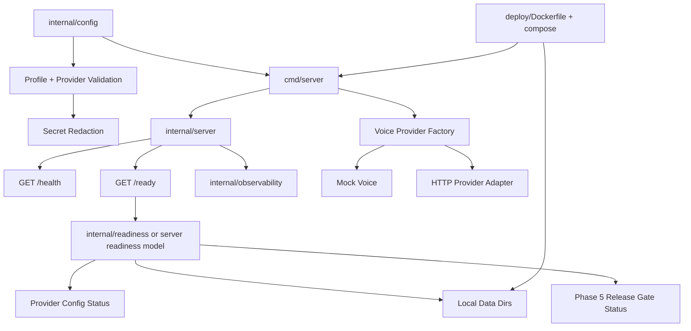

# Phase 6 Production Readiness, Provider Integration, and Deployment Plan

Date: 2026-06-22

Status: Stage 3 implementation complete; pending Stage 4 review.

Inputs:

- `docs/specs/phase-6-production-readiness-provider-deployment.md`
- `docs/design/phase-6-production-readiness-provider-deployment.md`
- Existing Phase 5 local governance implementation.

## Summary

Phase 6 turns the current local-first digital-human product into a production-shaped runtime without abandoning deterministic tests or local file storage. The approved Stage 1 direction is **Phase 6A: Provider and Deployment Readiness MVP**.

The first implementation should harden configuration and secrets before adding provider or deployment features. This prevents a common failure mode: connecting a real provider before the runtime can prove it will not leak credentials, start with invalid config, or pass readiness while unsafe.

## Autoplan Review Result

### CEO Review

Score: 8/10.

Verdict: hold the Phase 6A scope and reject a broad "enterprise production readiness" claim.

Accepted direction:

- Treat real providers as replaceable adapters, not as the product.
- Make deployment readiness visible through config validation, readiness, metrics, smoke tests, and runbooks.
- Keep local file storage. Do not introduce SQLite, Postgres, cloud database, or migration tooling in this phase.
- Defer full OAuth/RBAC, external eval platform, cloud moderation, Kubernetes, and compliance certification.

Risk called out:

- A visually impressive real-provider demo would create product excitement but weaken engineering confidence if secrets, readiness, and fake-server tests are not in place first.

### Engineering Review

Score: 8/10.

Verdict: approve a seven-slice TDD plan with config/redaction first, then provider adapter, readiness, deployment, smoke tests, and docs.

Existing surfaces to reuse:

- `internal/config` already loads YAML and env overrides.
- `internal/voice` already defines `TTSClient`, `ASRClient`, mock clients, and result shapes.
- `internal/server` already serves `/health`, `/metrics`, `/chat`, `/chat/stream`, `/experience/stream`, `/app`, and `/admin`.
- `internal/observability` already has in-memory metrics and Prometheus export.
- `internal/governance` already has release gate and decision records.
- `cmd/server` already wires config, local runtime, mock voice, admin stores, static assets, and API key auth.
- `deploy/` currently only contains `.gitkeep`, so deployment artifacts can be added cleanly.

Critical engineering decision:

- Add production-shaped readiness as a separate concept from `/health`. `/health` stays liveness; `/ready` reports dependency/config/release-gate readiness without leaking secrets.

### Design Review

Score: 7/10.

Verdict: no major visual redesign in Phase 6. UI work should be limited to honest provider/readiness/admin status if needed by the implementation.

Constraints:

- Do not redesign `/app` or `/admin` as part of deployment readiness.
- If any UI status is added, it must be compact, operational, and backed by real endpoint state.
- Avoid marketing text or production claims in UI copy.

### DX Review

Score: 8/10.

Verdict: Phase 6 has a developer/operator-facing surface, so docs and commands are part of the product.

Required DX outcomes:

- A new developer can run production-like local compose within a few commands.
- Missing config errors name the exact variable/key and the reason.
- `.env.example` is copy-paste usable and contains no real secrets.
- Runbooks contain exact PowerShell-friendly commands because this project is currently developed on Windows.
- Docker unavailability must produce a documented fallback path rather than blocking all verification.

## Decision Audit Trail

| # | Phase | Decision | Classification | Principle | Rationale | Rejected |
|---|---|---|---|---|---|---|
| 1 | CEO | Implement Phase 6A as provider/deployment readiness MVP | Auto-decided | Bias toward action | This closes the next real product gap without pretending to solve enterprise operations | Broad enterprise production readiness |
| 2 | CEO | Keep local file storage | User preference | Respect explicit constraint | User previously rejected SQLite for now, and local stores are already implemented | SQLite/Postgres migration |
| 3 | Eng | Add config/redaction before provider adapter | Auto-decided | Safety before surface area | Every real-provider path depends on trustworthy secret handling and validation | Provider demo first |
| 4 | Eng | Add `/ready` separately from `/health` | Auto-decided | Clear contracts | Liveness and readiness answer different operational questions | Overloading `/health` |
| 5 | Eng | Use fake-server-only provider tests | Auto-decided | Determinism | CI must not require credentials or real provider availability | Real provider calls in tests |
| 6 | Design | Avoid UI redesign | Auto-decided | Scope control | Phase 6 is operational hardening, not a new visual product surface | Redesigning `/app` or `/admin` |
| 7 | DX | Treat runbooks and `.env.example` as deliverables | Auto-decided | Developer empathy | Production-like local use fails without exact commands and expected outcomes | Code-only implementation |

## Scope

### In Scope

- Environment profile and provider config shape.
- Secret redaction and redaction tests.
- Provider factory and one first real-provider-shaped adapter using fake-server tests.
- `/ready` endpoint and readiness model.
- Provider latency/error/fallback metrics.
- Request ID propagation in HTTP handling and logs where practical.
- Dockerfile and local Docker Compose setup with local data volumes.
- `.env.example` and deployment runbook.
- Smoke tests or smoke script for production-like local runtime.
- README and release notes updates that describe only shipped behavior.

### Out of Scope

- SQLite, Postgres, cloud database, or migration framework.
- Real provider calls in CI.
- Mandatory paid provider accounts.
- OAuth, SSO, billing, or full production RBAC.
- Kubernetes production manifests.
- External eval platform or cloud moderation.
- SOC 2, GDPR, or compliance certification claims.
- Real 3D/Live2D/video avatar provider integration.
- Major `/app` or `/admin` visual redesign.

## Architecture Plan



Recommended package boundaries:

- `internal/config`: profile, provider endpoint/key env var config, validation, redacted summary.
- `internal/secret` or `internal/config`: redaction helper. Prefer `internal/config` if only config values need redaction; use `internal/secret` if logs/readiness/errors need a shared utility.
- `internal/voice`: provider factory and first HTTP-shaped adapter.
- `internal/server`: `/ready`, request ID middleware, readiness status response.
- `internal/observability`: metrics naming tests if new labels/observations need helper coverage.
- `deploy/`: Dockerfile, compose, deployment README.

## Implementation Slices

Each slice must be implemented with Superpowers TDD in Stage 3: RED, GREEN, REFACTOR. Do not write production code before the failing test for that slice exists.

### P6-01 Config Profile and Provider Validation

Goal: make runtime mode and provider requirements explicit.

Files:

- `internal/config/config.go`
- `internal/config/config_test.go`
- `configs/app.yaml`

RED:

- Test local profile defaults to local TTS/ASR and requires no provider secret.
- Test `production-like` profile with real TTS provider fails if key env var name or base URL is missing.
- Test env overrides for profile/provider/base URL/key env var.
- Test validation error names the missing setting but not any secret value.

GREEN:

- Add profile field.
- Expand `ProviderConfig` with `BaseURL`, `APIKeyEnv`, optional `Timeout`.
- Validate provider config by profile.

REFACTOR:

- Keep YAML parser simple and existing style-preserving.
- Keep unknown config key failures.

### P6-02 Secret Redaction

Goal: guarantee secrets do not appear in logs, readiness payloads, or validation errors.

Files:

- `internal/config` or `internal/secret`
- `cmd/server/main.go`
- relevant tests

RED:

- Test API keys, bearer tokens, provider keys, and env-derived secret values redact to a stable placeholder.
- Test startup config summary omits raw `Server.APIKey` and provider key values.
- Test validation errors never include secret values.

GREEN:

- Add redaction utility and redacted config summary.
- Use redacted values in startup logs.

REFACTOR:

- Centralize redaction patterns so future providers inherit the same safety.

### P6-03 Voice Provider Factory and First HTTP Adapter

Goal: prove real-provider-shaped integration without making CI depend on a real provider.

Files:

- `internal/voice`
- `cmd/server/main.go`
- `internal/config`

RED:

- Test provider factory returns mock for `local`/`mock`.
- Test HTTP TTS adapter sends expected method/path/body/auth header to `httptest.Server`.
- Test non-2xx, malformed JSON, timeout, and empty input map to typed errors.
- Test no real network is used in unit tests.

GREEN:

- Add a generic HTTP TTS adapter or named first adapter if Stage 3 chooses one.
- Wire `cmd/server` to select TTS from config.

REFACTOR:

- Keep adapter thin; do not add a full provider framework.
- Keep mock as default.

First-provider recommendation:

- Start with TTS because Phase 4 already exposes audio readiness and provider metadata. ASR can follow the same pattern later.

### P6-04 Readiness Endpoint

Goal: expose production-shaped readiness separate from liveness.

Files:

- `internal/server`
- possible `internal/readiness`
- `cmd/server/main.go`

RED:

- Test `/health` still returns `{"status":"ok"}`.
- Test `/ready` returns ok for local profile with valid local stores.
- Test invalid provider config returns non-OK readiness without secret leakage.
- Test missing local data directory or unwritable data directory reports a component failure.
- Test release-gate status can be `ok`, `failed`, or `skipped` with reason.

GREEN:

- Add readiness model and handler.
- Wire server readiness dependencies from config/bootstrap.

REFACTOR:

- Keep readiness response stable and small.

### P6-05 Observability and Request IDs

Goal: make provider/deployment failures visible locally.

Files:

- `internal/server`
- `internal/observability`
- `cmd/server/main.go`

RED:

- Test request ID is generated when absent and preserved when supplied.
- Test provider latency/error metrics are recorded with provider/status labels.
- Test readiness failure increments or exposes a stable metric.
- Test metrics contain no secret values.

GREEN:

- Add request ID middleware or handler wrapper.
- Add observations/counters around provider calls and readiness.

REFACTOR:

- Avoid high-cardinality labels; never put request ID into metric labels.

### P6-06 Deployment Package

Goal: run the app in a production-like local container setup with local data volumes.

Files:

- `deploy/Dockerfile`
- `deploy/docker-compose.yml`
- `deploy/README.md`
- `.env.example`
- `.dockerignore` if needed

RED:

- Test or lint deployment files where tools are available.
- Verify compose config references local/mock providers by default.
- Verify no real secrets appear in `.env.example`.

GREEN:

- Add multi-stage Dockerfile.
- Add compose service with mounted local data and explicit port.
- Add PowerShell-friendly run instructions.

REFACTOR:

- Keep deployment minimal; no database service.

### P6-07 Smoke Verification

Goal: prove the production-like runtime answers and exposes required surfaces.

Files:

- `deploy/smoke.ps1` or `cmd/cli smoke`
- tests if implemented in Go

RED:

- Test smoke command fails clearly on missing base URL.
- Test smoke command validates `/health`, `/ready`, `/chat`, `/chat/stream` or equivalent, `/app`, `/admin`, and `/metrics`.
- Test failure messages include problem, likely cause, and fix.

GREEN:

- Add smoke script/command.
- Keep command usable without real providers.

REFACTOR:

- Prefer Go smoke command if PowerShell quoting becomes fragile.

### P6-08 Docs and Release Notes

Goal: describe shipped Phase 6 behavior honestly.

Files:

- `README.md`
- `RELEASE_NOTES.md`
- `docs/plans/phase-6-production-readiness-provider-deployment-plan.md`

RED:

- `rg` checks for Phase 6 docs links.
- `rg` checks exclusions remain explicit: no SQLite, no compliance certification, no real provider required in CI.
- `rg` checks run commands exist for deploy and smoke.

GREEN:

- Update docs after implementation.

REFACTOR:

- Remove any future-tense claim that implies shipped provider/deploy features before they exist.

## Parallel Workstreams

Can run in parallel after P6-01/P6-02:

- Provider adapter work: P6-03.
- Readiness and observability work: P6-04/P6-05.
- Deployment docs/artifacts: P6-06.

Must remain sequential:

- P6-01 before all provider/deploy work.
- P6-02 before any provider logging or readiness output.
- P6-04 before P6-07.
- P6-08 after shipped behavior is known.

## Test Matrix

| Area | Test type | Required cases | Command |
|---|---|---|---|
| Config profile | Unit | local defaults, production-like missing provider settings, env overrides, unknown key | `go test ./internal/config` |
| Secret redaction | Unit | API key, bearer token, provider env secret, validation error safety | `go test ./internal/config ./internal/observability` |
| Voice provider | Unit | mock default, HTTP request shape, auth header, non-2xx, malformed body, timeout | `go test ./internal/voice` |
| Server readiness | Handler unit | `/health`, `/ready` ok, invalid provider, missing data dir, release gate skipped/failed | `go test ./internal/server` |
| Observability | Unit/handler | request ID, provider metrics, readiness metrics, no secret labels | `go test ./internal/server ./internal/observability` |
| Server wiring | Integration-ish unit | config selects mock/provider, admin data dir mounted path accepted | `go test ./cmd/server` |
| Deployment files | Static verification | Dockerfile exists, compose parses if Docker exists, no DB service, no secrets | `docker compose -f .\deploy\docker-compose.yml config` when Docker is available |
| Smoke | Local runtime | health, ready, chat, stream, app/admin, metrics | `.\deploy\smoke.ps1 -BaseUrl http://localhost:8080` or Go equivalent |
| Full regression | Repo | all packages compile/test | `go test ./...` |
| Static analysis | Repo | vet clean | `go vet ./...` |

Docker fallback:

- If Docker is not available locally, Stage 3 must still run all Go tests and static doc/config checks, and document Docker verification as not run.

## Failure Modes Registry

| Failure mode | Severity | Expected defense |
|---|---|---|
| Secret leaks in logs/readiness/errors | High | Central redaction helper and tests |
| Real provider test calls paid external API | High | Fake-server tests only |
| `/health` says ok while runtime cannot serve traffic | High | Separate `/ready` endpoint |
| Production-like profile starts with missing provider config | High | Startup validation and readiness failure |
| Provider outage causes confusing 500s | Medium | Typed provider errors, metrics, runbook |
| Docker setup loses local data | Medium | Explicit volume mounts and backup/restore docs |
| Metrics expose high-cardinality request IDs | Medium | Request ID in logs/headers only, not metric labels |
| README claims production compliance | Medium | Docs checks and release notes exclusions |

## Developer Journey

Target time to hello-world production-like local runtime: under 10 minutes after Phase 6.

Expected flow:

1. Read README Phase 6 section.
2. Copy `.env.example` to local env file.
3. Run local server or Docker Compose with mock providers.
4. Check `/health` and `/ready`.
5. Run smoke command.
6. Optional: configure first real provider against a fake/local endpoint or real endpoint manually.
7. Read runbook when readiness fails.

## Verification Before Stage 3 Completion

Stage 3 is not complete until these commands are run or explicitly marked unavailable:

```powershell
go test ./...
go vet ./...
go build ./cmd/server
go build ./cmd/cli
rg -n "Phase 6|production-like|ready|SQLite|compliance|real provider" README.md RELEASE_NOTES.md docs
docker compose -f .\deploy\docker-compose.yml config
.\deploy\smoke.ps1 -BaseUrl http://localhost:8080
```

## Implementation Tasks

- [x] P6-01 Config profile and provider validation.
- [x] P6-02 Secret redaction.
- [x] P6-03 Voice provider factory and first HTTP TTS adapter.
- [x] P6-04 Readiness endpoint.
- [x] P6-05 Observability and request IDs.
- [x] P6-06 Deployment package.
- [x] P6-07 Smoke verification.
- [x] P6-08 Docs and release notes.

## Open Decisions

No blocking decisions remain for Stage 3 if the user accepts the default plan.

Defaults for Stage 3:

- First real-provider-shaped adapter: HTTP TTS adapter.
- Deployment target: local Docker Compose only.
- Auth: keep API key auth; do not add OAuth/RBAC.
- Persistence: local file storage only.
- Provider failure in production-like profile: fail closed unless explicitly configured for fallback.

## GSTACK REVIEW REPORT

| Review | Trigger | Why | Runs | Status | Findings |
|--------|---------|-----|------|--------|----------|
| CEO Review | `$gstack-autoplan` | Scope and strategy | 1 | clean | Held Phase 6A scope; rejected enterprise-production overreach |
| Codex Review | `$gstack-autoplan` | Independent plan challenge | 1 | clean | Main risk is provider-first work before redaction/readiness |
| Eng Review | `$gstack-autoplan` | Architecture and tests | 1 | clean | Seven TDD slices plus docs; no critical gaps |
| Design Review | `$gstack-autoplan` | UI/UX implications | 1 | clean | No redesign needed; status UI only if backed by real endpoint state |
| DX Review | `$gstack-autoplan` | Developer/operator experience | 1 | clean | Requires `.env.example`, runbooks, smoke command, Docker fallback |

VERDICT: CEO + ENG + DESIGN + DX CLEARED for Stage 3 after user approves this plan.

NO UNRESOLVED DECISIONS
